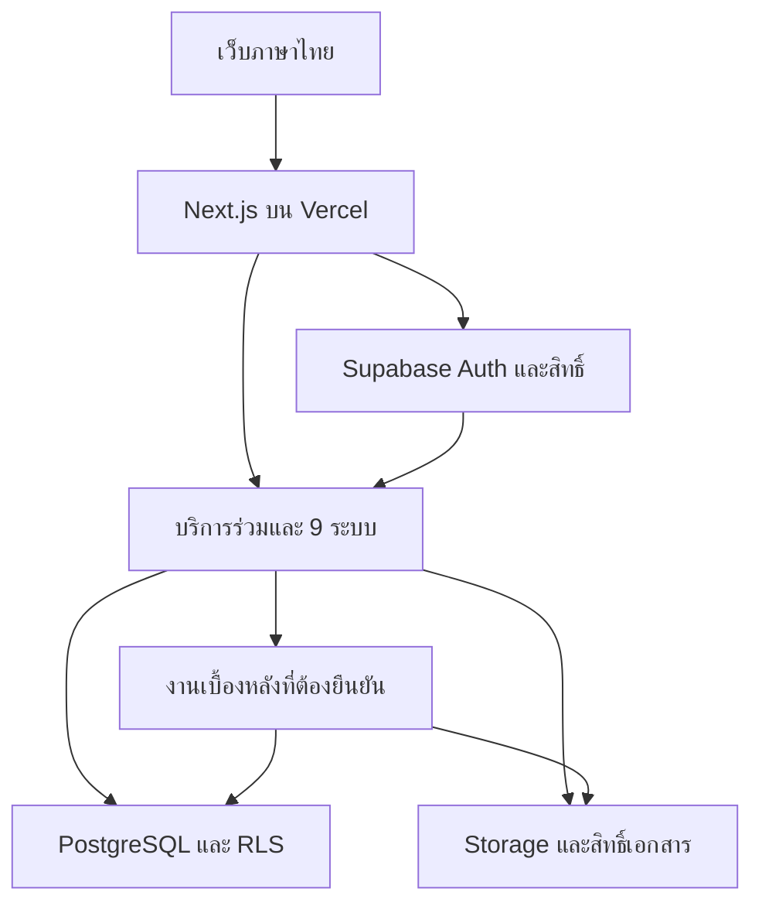
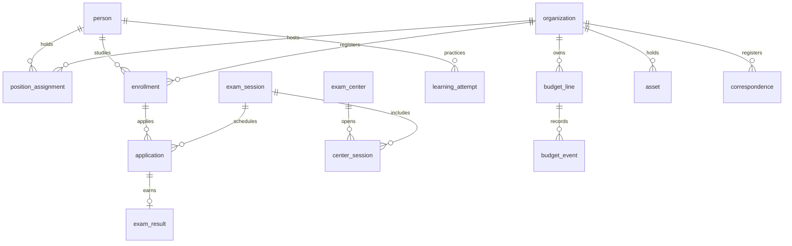

# BLUEPRINT — เว็บไซต์กองบริหารทะเบียนและวัดผล

> **สถานะ:** รุ่นเอกสาร 1.1 — ข้อกำหนดผู้ใช้และข้อเสนอการออกแบบ แยกสถานะตาม DECISIONS
> **วันที่ปรับบท 01:** 3 ตุลาคม 2569 (2026-10-03)
> **แหล่งข้อมูล:** ไฟล์แนบ `Pasted markdown.md`
> **ตำแหน่งไฟล์:** `BLUEPRINT.md` ที่รากโครงการ
> **สถานะการพัฒนา:** ไฟล์นี้ไม่ได้ยืนยันว่ามี implementation, migration, พรอมป์ต์ 72 บท หรือผลทดสอบแล้ว

ข้อกำหนดล่าสุดของผู้ใช้และบันทึก DEC-001 ถึง DEC-014 ใช้เป็นหลักเมื่อข้อความในเอกสารแนบเดิมต่างกัน อ่าน [00_MASTER_PROMPT.md](00_MASTER_PROMPT.md), [Project Charter](docs/PROJECT_CHARTER.md), [DECISIONS](docs/DECISIONS.md), [OPEN_QUESTIONS](docs/OPEN_QUESTIONS.md) และ [PROGRESS](docs/PROGRESS.md) ร่วมกัน

### การใช้เอกสาร

ใช้เป็นกรอบร่วมสำหรับกำหนด requirements, ออกแบบฐานข้อมูลและสิทธิ์, แบ่งงาน และตรวจรับทั้ง 9 ระบบ ข้อความ “ต้อง” เป็นข้อกำหนดการออกแบบ ส่วนเทคโนโลยี เส้นทาง และค่าทดลองที่เสนอเป็นข้อเสนอที่ต้องบันทึกการตัดสินใจก่อนนำไปใช้จริง

- **Confirmed:** ขอบเขตเว็บไซต์เดียว 9 ระบบและบริการกลางตามเอกสารที่ผู้ใช้แนบ ไม่ใช่การรับรองกฎทางการหรือข้อมูลจริง
- **Confirmed:** เทคโนโลยีและโครงเมนูตามข้อกำหนดล่าสุดของผู้ใช้
- **Proposal:** เส้นทางที่ยังไม่ระบุ โครงไฟล์ ลำดับส่งมอบ งานเบื้องหลัง และเป้าหมายเชิงปฏิบัติการ
- **TO VERIFY / Needs Legal Review:** แบบฟอร์ม รหัสทางการ กฎสอบ อำนาจอนุมัติ วงเงิน นโยบายเผยแพร่ ระยะเก็บ และประเด็นกฎหมาย ให้ติดตามตามหัวข้อ 17

เว็บไซต์เดียวสำหรับระบบงาน 9 ด้าน ใช้บัญชีผู้ใช้ ข้อมูลกลาง และหน้าบริการร่วมกัน พร้อมแยกสิทธิ์ตามหน้าที่และพื้นที่รับผิดชอบ ไฟล์นี้กำหนดแบบระบบจากเอกสารแนบ ต้นฉบับอ้างถึงแผนพัฒนา 72 บทและโฟลเดอร์ `prompts/` แต่ไม่ได้แนบเนื้อหาส่วนนั้นมาด้วย จึงยังไม่ถือว่ามีไฟล์พรอมป์ต์หรือแผน 72 บทอยู่ในโครงการ

รุ่นแบบออกแบบ 1.1 วันที่ 3 ตุลาคม 2569 ชื่อโครงการใช้ตามที่ผู้ใช้กำหนด ส่วนตราสัญลักษณ์และเนื้อหาทางการยังต้องยืนยัน เอกสารนี้เป็นแบบออกแบบสำหรับใช้วางแผนพัฒนา การทำให้เป็นระบบใช้งานจริงต้องพัฒนาและตรวจรับจากผลการรันในโครงการจริง

## 1 เป้าหมายและหลักการร่วม

บุคคลหนึ่งมีทะเบียนกลางเพียงรายการเดียว แล้วเชื่อมกับตำแหน่ง หน้าที่ ผู้สอน ผู้เรียน ผู้สมัคร และผู้รับเอกสารได้ตามช่วงเวลา หน่วยงานและสนามสอบใช้อ้างอิงข้ามระบบ ส่วนการทำรายการแต่ละด้านเก็บในโมดูลของตน เช่น การเป็นประธานสนามสอบในปีหนึ่งเป็นการมอบหมายที่เชื่อมคนกับสนามและรอบสอบ ไม่เป็นชื่อและเบอร์ติดต่อที่กรอกซ้ำในหลายเว็บไซต์

ใช้ repository เดียวและฐานข้อมูล PostgreSQL เดียวที่แบ่งขอบเขตโมดูล ไม่เริ่มจาก microservices 9 ชุด งานเบื้องหลังใช้โค้ดและสัญญาข้อมูลจากโครงการเดียว วิธีรันงานยาวต้องกำหนดตาม Q011 โดยไม่สมมติว่าคำขอบน Vercel ทำงานต่อเนื่องได้เสมอ การเรียกใช้ข้อมูลข้ามโมดูลผ่านบริการที่กำหนดเจ้าของชัดเจน ไม่เขียนข้อมูลของโมดูลอื่นโดยตรงโดยไม่รักษากฎธุรกรรม

แยกข้อมูลสาธารณะ ข้อมูลของเจ้าของข้อมูล และข้อมูลเจ้าหน้าที่ การซ่อนเมนูช่วยจัดหน้าจอ ส่วนการอนุญาตต้องตรวจฝั่ง server ทุกครั้ง รวมการอ่าน แก้ไข ดาวน์โหลด ส่งออก อนุมัติ และงานเบื้องหลัง เก็บประวัติที่มีวันเริ่มสิ้นสุดและหลักฐาน ไม่ใช้การแก้ค่าปัจจุบันทับเป็นประวัติทั้งหมด

## 2 เมนูของเว็บไซต์เดียว

โซนสาธารณะใช้ `/...` โดยไม่ต้องเข้าสู่ระบบ ส่วนพื้นที่ทำงาน `/app/...` ต้องเข้าสู่ระบบผ่าน Supabase Auth และตรวจสิทธิ์ฝั่ง server ชื่อและจำนวนเมนูเป็น Confirmed; เส้นทางในตารางเป็น Proposal ยกเว้นเส้นทาง `/app/admin` ที่ผู้ใช้กำหนด ห้ามเริ่มสร้างหน้าเว็บในบท 01

### เมนูสาธารณะ 7 เมนู

| เมนู | เส้นทางเสนอ | หน้าที่ |
| --- | --- | --- |
| หน้าแรก | / | ข่าวสำคัญและทางลัด |
| ทะเบียน | /registry | ข้อมูลทะเบียนที่อนุญาตเผยแพร่ |
| สอบธรรมสนามหลวง | /exams | ข่าวสอบและค้นผลที่รับรองเผยแพร่แล้ว |
| ติดตามคำขอ | /requests/track | แสดงเฉพาะสถานะและรายละเอียดที่มีสิทธิ์ |
| คลังข้อสอบ | /learn | การเรียนและแบบฝึกที่อนุญาต |
| ดาวน์โหลด | /downloads | ไฟล์และเทมเพลตกลาง |
| ติดต่อเรา | /contact | ข้อมูลติดต่อหน่วยงานกลางชุดเดียว |

### เมนูพื้นที่ทำงาน 9 เมนู

| เมนู | กลุ่มแถบข้าง | เส้นทางเสนอ | ระบบธุรกิจที่เชื่อม |
| --- | --- | --- | --- |
| แดชบอร์ด | นอกกลุ่มงาน | /app | รวมงานตามสิทธิ์ |
| บุคลากร | บุคคลและทะเบียน | /app/people | 1 |
| ทะเบียนสถานที่ | บุคคลและทะเบียน | /app/organizations | 2; สนามสอบเป็นเมนูย่อย |
| สมัครสอบและผลสอบ | การสอบและการเรียน | /app/exams | 5 และ 9; Excel เป็นเมนูย่อย |
| คำขอ | บุคคลและทะเบียน | /app/requests | 4 |
| คลังข้อสอบ | การสอบและการเรียน | /app/learning | 3 |
| สารบรรณ | งานสำนักงาน | /app/office | 8 |
| งบประมาณ | งานสำนักงาน | /app/budget | 6 |
| พัสดุ-ครุภัณฑ์ | งานสำนักงาน | /app/inventory | 7 |

เมนูผู้ดูแลระบบที่ `/app/admin` แสดงเฉพาะผู้ดูแลและต้องตรวจสิทธิ์ฝั่ง server ด้วย เมนูนี้แยกจาก 9 เมนูหลักของพื้นที่ทำงาน แดชบอร์ดแยกจากสามกลุ่มแถบข้าง ส่วน 8 เมนูงานจัดอยู่ในสามกลุ่มตามตาราง ระบบ Excel ไม่เป็น login หรือทะเบียนใบสมัครอีกชุด ใช้บริการระบบ 5 และมีทางลัดย่อยเสนอ `/app/exams/imports`

### หน้ากลางที่มีต้นทางเพียงชุดเดียว

| บริการ | เส้นทางหลักเสนอ | เจ้าของ |
| --- | --- | --- |
| ติดต่อเรา | /contact | C04 |
| ดาวน์โหลด | /downloads | C04 |
| ข่าวประกาศ | /news; แสดงทางลัดจากหน้าแรก | C04 |
| เข้าสู่ระบบ | /login | C02 |
| แจ้งเตือน | /app/notifications | C02 |
| ข้อมูลหน่วยงานส่วนกลาง | แหล่งเนื้อหากลางที่ C04 ดูแล | C04 |

ข่าว คู่มือ FAQ และนโยบายเป็นเนื้อหาหรือทางลัดกลาง ไม่เพิ่มเป็นเมนูหลักแทนรายการ 7 เมนู ทุกโมดูลเชื่อมต้นทางเดียว ข้อมูลผู้รับผิดชอบสนาม/หนังสือเป็นข้อมูลปฏิบัติงาน ไม่ใช่หน้าติดต่อเราอีกชุด การแจ้งเตือน ผลค้น พิมพ์และดาวน์โหลดต้องใช้สิทธิ์เดียวกับรายการต้นทาง ติดตามคำขอสาธารณะต้องไม่เปิดรายละเอียดหรือหลักฐานส่วนตัวโดยรู้เลขคำขออย่างเดียว วิธีพิสูจน์สิทธิ์ติดตามกำหนดในบทที่เกี่ยวข้อง

ทุกหน้าต้องมีสถานะกำลังโหลด ไม่มีข้อมูล ผิดพลาด ไม่มีสิทธิ์ และไม่พบหน้า ข้อความบนเว็บเป็นไทย วันที่แสดง พ.ศ. และใช้ฟอนต์ Sarabun

## 3 บทบาทและขอบเขตสิทธิ์

ใช้ RBAC กำหนดสิ่งที่ทำได้ และ scope กำหนดรายการที่ทำได้ตามหน่วยตนและหน่วยใต้สังกัดในสายที่ได้รับมอบหมาย รวมช่วงเวลา เปิด RLS ทุกตารางของโครงการและตรวจสิทธิ์ฝั่ง server ทุกช่องทาง ภาค จังหวัด อำเภอ ตำบล สำนักเรียน สถานศึกษา และสนามสอบต้องอ้างลำดับที่ยืนยัน ไม่ใช้จังหวัดเป็นสิทธิ์แทนทุกสายปกครอง การมีตำแหน่งในทำเนียบไม่เท่ากับได้รับบัญชีหรือสิทธิ์อนุมัติอัตโนมัติ

| บทบาท | งานที่ได้รับมอบหมาย | ขอบเขตเริ่มต้น |
|---|---|---|
| ผู้เยี่ยมชมทั่วไป | ค้นทำเนียบและผลที่อนุญาต ข่าว คู่มือ หลักสูตร | ข้อมูล public เท่านั้น |
| เจ้าของข้อมูลและผู้เรียน | ตรวจของตน เสนอแก้ข้อมูล เรียน ทำแบบทดสอบ | person และ enrollment ของตน |
| เจ้าหน้าที่สำนักหรือสถานศึกษา | ดูและเสนอผู้สมัคร ตรวจรายชื่อ อัปโหลด Excel | หน่วยงานที่ได้รับมอบหมาย |
| เจ้าหน้าที่สนามสอบ | ผู้เข้าสอบ ที่นั่ง เอกสารและคะแนนที่ได้รับมอบหมาย | รอบสอบและสนามที่กำหนด |
| เจ้าหน้าที่พื้นที่ | ตรวจทะเบียนและคำขอในความรับผิดชอบ | สายปกครองและพื้นที่ที่กำหนด |
| ผู้สอนและผู้ตรวจเนื้อหา | บทเรียน ข้อสอบ และความก้าวหน้าที่ได้รับมอบหมาย | หลักสูตรหรือกลุ่มผู้เรียน |
| เจ้าหน้าที่และผู้อนุมัติการเงิน | แผนงบ รายการจ่าย การตรวจและอนุมัติตามวงเงิน | หน่วยงาน แหล่งเงิน ช่วงมอบหมาย |
| เจ้าหน้าที่พัสดุ | คลัง รายการเคลื่อนไหว ครุภัณฑ์และการตรวจรับ | คลัง หน่วยงาน หน้าที่ที่กำหนด |
| เจ้าหน้าที่สารบรรณและผู้รับหนังสือ | ลงทะเบียน ส่ง รับทราบ มอบหมาย | ACL ของเรื่องและรุ่นเอกสาร |
| ผู้อนุมัติส่วนกลาง | ตัดสินเรื่องเฉพาะประเภทที่มีอำนาจ | ขอบเขตและประเภทคำขอที่กำหนด |
| ผู้ตรวจสอบ | รายงานและหลักฐานตามภารกิจตรวจ | read only พร้อมบันทึกการเข้าถึง |
| ผู้ดูแลเทคนิค | บัญชี การตั้งค่า deployment การกู้คืน | ไม่มีสิทธิ์อนุมัติงานธุรกิจโดยปริยาย |

ผู้ใช้หนึ่งคนมีหลายบทบาทได้ แต่ทุกคำขอสำคัญต้องแยกผู้สร้างกับผู้อนุมัติ ตรวจการมอบหมายตามเวลา และเพิกถอนเมื่อหน้าที่เปลี่ยน เอกสารลับมี ACL เพิ่มเติม การเป็นผู้ดูแลระบบไม่ให้สิทธิ์อ่านเอกสารลับทุกฉบับ การแจ้งเตือนและผลค้นต้องเคารพสิทธิ์เดียวกับรายการต้นทาง

## 4 เทคโนโลยีที่กำหนดและสถาปัตยกรรมเสนอ

เทคโนโลยี Confirmed คือ Next.js App Router + TypeScript, Tailwind CSS + shadcn/ui, ฟอนต์ Sarabun, Supabase PostgreSQL/Auth/Storage/RLS, ExcelJS และ deploy บน Vercel เอกสารพิมพ์ใช้หน้า HTML แบบ print แล้วผู้ใช้บันทึก PDF จากเบราว์เซอร์ บท 01 ยังไม่ติดตั้งแพ็กเกจ เลือกเวอร์ชัน หรือสร้างบัญชีบริการ

ใช้ Supabase Auth บัญชีเดียว แยกบัญชีจากทะเบียนบุคคล และใช้ PostgreSQL กลาง ตรวจสิทธิ์ใกล้ข้อมูลทั้งฝั่ง server และ RLS โดย default ปฏิเสธตามบทบาท สายปกครองและเวลามอบหมาย ฟิลด์สาธารณะใช้ DTO ขั้นต่ำ ไม่ส่งเลขประจำตัวประชาชน วันเกิด ที่อยู่ส่วนตัว เบอร์ส่วนตัว หรือหลักฐานส่วนตัว ข้อจำกัดเดียวกันใช้กับ API cache export print และผลค้น

ทุกการเพิ่ม แก้ หรือปิดใช้งานข้อมูลธุรกิจต้องบันทึก `audit_logs` ร่วมกับธุรกรรม และไม่มีสิทธิ์ hard delete ข้อมูลจริง กลไก trigger/RPC และ schema กำหนดในบทฐานข้อมูลผ่าน migration เท่านั้น รายการ log ต้องไม่บันทึก secret หรือข้อมูลส่วนตัวเกินจำเป็น ผู้สร้างห้ามอนุมัติงานสำคัญของตน และผู้ดูแลเทคนิคไม่รับอำนาจอนุมัติธุรกิจโดยปริยาย

Storage เป็น private ก่อน ใช้สถานะ quarantine ตรวจชนิดไฟล์ scan และ ACL รวมรุ่นไฟล์ก่อนให้ใช้งาน การเผยแพร่ต้องผ่านเจ้าของข้อมูล หน้า print ตรวจสิทธิ์เท่ารายการต้นทาง การเรียกงานด้วย service credential ต้องจำกัดความสามารถและตรวจสิทธิ์ต้นทาง เพราะการใช้กุญแจงานเบื้องหลังไม่ใช่สิทธิ์ธุรกิจอัตโนมัติ ห้ามส่งกุญแจ service หรือ secret ให้เบราว์เซอร์

งานอ่าน Excel scan export และแจ้งเตือนที่ยาวใช้สัญญาข้อมูลกลางและ retry-safe/outbox ตามความเสี่ยง วิธีรัน job และผู้ให้บริการ scan เป็น TO VERIFY ใน Q011 ไม่มีข้อกำหนดติดตั้ง Redis/BullMQ หรือ worker platform ในบทนี้ วิธีทำ transaction/RPC ต้องออกแบบก่อนเขียนบริการที่นั่ง งบ stock และ import แล้วตรวจ concurrency กับ PostgreSQL จริง

แยก dev/staging/production และข้อมูลสมมติออกจากข้อมูลจริง ไม่ใช้ไฟล์ local ของเว็บเก็บเอกสารถาวร รายละเอียด environment backup/restore และเวอร์ชันแพ็กเกจยืนยันใน Q012 และบทตั้งโครงการ

## 5 ข้อมูลกลางและความสัมพันธ์

| ข้อมูล | เจ้าของข้อมูล | การอ้างอิงข้ามระบบ |
|---|---|---|
| person และชื่อย้อนหลัง | ระบบ 1 | ตำแหน่ง ผู้สอน ผู้เรียน ผู้สมัคร ประธาน ผู้รับหนังสือ ผู้ถือครอง |
| user_account role scope | ส่วนกลาง | login และสิทธิ์ทั้ง 9 ระบบ แยกจากทะเบียนบุคคล |
| organization Relation address | ระบบ 2 | สังกัด ผู้สมัคร คำขอ งบ คลัง และสารบรรณ |
| geography กับสายปกครอง | ส่วนกลางและระบบ 2 | พื้นที่ค้นหาและขอบเขตสิทธิ์โดยไม่ถือว่าเป็นโครงเดียวกัน |
| academic_year exam_session center | ระบบ 2 และ 5 | สนามรายปี สมัคร ที่นั่ง คะแนน ประกาศผล และ importer |
| document file_version ACL | บริการเอกสารกลาง | หลักฐานทุกระบบและหนังสือระบบ 8 |
| workflow audit_logs outbox | ส่วนกลาง | ตรวจอนุมัติ ประวัติ การแจ้งเตือนและงานเบื้องหลัง |
| fiscal_year และ budget_ledger | ระบบ 6 | โครงการจัดสอบ รายการพัสดุ ใบรับรองเบิกและหนังสือ |
| curriculum question attempt | ระบบ 3 | ใช้ในการเรียนและการประเมินเพื่อการเรียนรู้ |
| enrollment application result_release | ระบบ 5 | import ระบบ 9 และการเผยแพร่ผลรายปี |

ERD เชิงแนวคิดเพื่อเริ่มพัฒนาแสดงเฉพาะความสัมพันธ์แกนหลัก ระหว่างออกแบบฐานข้อมูลต้องขยายเป็น logical ERD ที่มีฟิลด์ ความไม่ซ้ำและกฎครบทุกโมดูล

ใช้ foreign keys กับรหัสกลาง ไม่ใช้ชื่อเป็น key บันทึกวันที่ที่มีผลกับวันที่บันทึกคนละฟิลด์ ใช้ snapshot กับใบสมัคร ที่อยู่จัดส่ง รายชื่อผู้รับหนังสือ คะแนนและผลประกาศ เพื่อให้ข้อมูลปีเก่ายังตรวจได้เมื่อทะเบียนปัจจุบันเปลี่ยน ข้อมูลที่จบรายการใช้เหตุการณ์ยุติ ไม่ลบธุรกรรมหรือผลสอบ

ประวัติธุรกิจที่ต้องตรวจย้อนหลังกับข้อมูลส่วนตัวที่ต้องลบเมื่อหมดวัตถุประสงค์ต้องมีนโยบายแยกกัน การเก็บ history ไม่ใช่คำสั่งเก็บข้อมูลอ่อนไหวตลอดไป การแก้ไขข้อมูลผิดใช้เหตุการณ์แก้ไขและเชื่อมหลักฐาน ส่วนการลบหรือปกปิดตามนโยบายต้องควบคุมและบันทึกการดำเนินการ

## 6 ระบบ 1 บุคลากรคณะสงฆ์และฝ่ายการศึกษา

ทะเบียนครอบคลุมเลขาฯ รองเจ้าคณะ และเจ้าคณะระดับตำบล อำเภอ จังหวัด ภาค รวม จศป. ทุกประเภทในแผนกธรรม บาลี สามัญ และปริยัตินิเทศก์ตามรหัสทางการที่ยืนยัน สร้าง master ประเภทให้เพิ่มรหัสได้ ไม่ hardcode คำว่า ทุกแท่ง โดยไม่มีคำจำกัดความ

หน้าสำคัญมีรายชื่อ รายละเอียด ข้อมูลของฉัน ประวัติหน้าที่ ประวัติสังกัด เสนอแก้ข้อมูล คำขอย้าย ลาออก มรณภาพหรือเสียชีวิต และลาสิกขา ทุกเรื่องแนบหลักฐาน ผ่านผู้ตรวจ และมีวันมีผล การลาออกยุติหน้าที่ที่ระบุ การลาสิกขาเปลี่ยนสถานะบรรพชิต การเสียชีวิตมีการยุติหน้าที่และบัญชีตามนโยบาย ห้ามใช้สถานะเดียวแทนทุกผลกระทบ

ตารางเฉพาะมี person_private person_name_history education_branch position_type position_assignment affiliation_history person_status_event และ person_change_request จุดตรวจรับสำคัญคือค้นข้อมูลย้อนหลังได้ไม่ถูกเขียนทับ ขอย้ายยังไม่เปลี่ยนสังกัดก่อนอนุมัติ และการย้ายหน้าที่ไม่คงสิทธิ์พื้นที่เก่าโดยไม่มีอำนาจ

## 7 ระบบ 2 หน่วยงาน ที่ตั้ง และสนามสอบ

ทะเบียนครอบคลุมชื่อและที่ตั้งของวัด สำนักเรียน สำนักศาสนศึกษา องค์กร สถานศึกษา และสนามสอบทั่วประเทศ รองรับรหัสและชื่อเดิม ความสัมพันธ์หลายประเภท ที่อยู่จัดส่งและที่ตั้งที่มีช่วงเวลา ช่องทางติดต่อหลายรายการ และการยืนยันความถูกต้องล่าสุด

สนามแม่บทกับการเปิดสนามรายรอบใช้คนละตาราง ประธาน ผู้รับข้อสอบ และผู้ประสานงานเป็นการมอบหมายของ person ตามปีหรือรอบสอบ รายงานจัดส่งใช้ snapshot ของผู้รับและที่อยู่ ณ วันจัดส่ง รายชื่อผู้รับข้อสอบไม่เป็นสิทธิ์เปิดดูเนื้อหาข้อสอบลับ

ตารางเฉพาะมี organization_type organization_relation address_version organization_location exam_center exam_session center_session และ exam_center_appointment จุดตรวจรับคือไม่มีวงจร parent ไม่มีหน่วยงานซ้ำจากชื่อคล้าย และข้อมูลปีเก่าไม่เปลี่ยนตามผู้รับหรือที่อยู่ปัจจุบัน การรองรับทั่วประเทศต้องแยกจากคำกล่าวว่าข้อมูลจริงครบทั่วประเทศแล้ว

## 8 ระบบ 3 คลังข้อสอบและการเรียน

จัดธรรมศึกษาเป็น 9 กลุ่ม ได้แก่ ประถมตรี ประถมโท ประถมเอก มัธยมตรี มัธยมโท มัธยมเอก อุดมตรี อุดมโท และอุดมเอก ภายในกำหนดวิชา หัวข้อ หลักสูตรและแหล่งที่มาเป็นรุ่น วิชาข้อเขียนใช้ rubric และผู้ตรวจโดยไม่ใช้การตรวจปรนัยแทน

ลำดับหลักคือ เลือกหลักสูตร ทำแบบทดสอบก่อนเรียน รับสรุปหัวข้อที่ควรเรียน เรียนบทเรียนและแบบฝึก ทำแบบทดสอบหลังเรียน แล้วดูความก้าวหน้า กฎปลดล็อกตรวจจาก backend พร้อม resume กับ autosave เมื่อเครือข่ายขาด

ตารางเฉพาะมี curriculum Course lesson_version question_version answer_key assessment_blueprint attempt attempt_item response learning_progress และ manual_grading เก็บคำถามและคำตอบที่ใช้ในแต่ละครั้งเป็น snapshot ไม่ส่งเฉลยก่อนส่งคำตอบ คะแนนส่วนนี้เป็นการประเมินเพื่อการเรียนรู้ แยกจากผลสอบทางการของระบบ 5

## 9 ระบบ 4 คำขอจัดตั้ง ยุบ และเปลี่ยนสนามสอบ

รองรับจัดตั้งและยุบสำนักเรียนหรือสำนักศาสนศึกษา เปิด ปิด และย้ายสนามสอบนักธรรมหรือธรรมศึกษา แต่ละเรื่องมีทะเบียนเป้าหมาย ผู้เสนอ แบบคำขอ หลักฐาน ผู้ตรวจ ผู้อนุมัติ วันที่มีผล และรุ่นกฎ

เส้นทางร่าง ส่ง ตรวจ ส่งกลับแก้ อนุมัติหรือปฏิเสธ แล้วมีผลตามวันจริง การอนุมัติไม่จำเป็นต้องมีผลวันเดียวกัน ก่อนยุบหรือปิดต้องตรวจใบสมัคร หน้าที่บุคลากร และเรื่องค้าง พร้อมแผนจัดการที่ได้รับอนุมัติ ไม่ลบสนามหรือโยกใบสมัครอัตโนมัติ

ตารางเฉพาะมี change_request request_version decision impact_assessment status_event และ activation_record เอกสารคำสั่งอ้างบริการกลางและเชื่อมสารบรรณ ติดตาม public ได้เฉพาะรายละเอียดที่อนุญาต คำสั่งผิดต้องใช้คำสั่งแก้ไขหรือเพิกถอนพร้อมหลักฐาน ไม่ลบประวัติต้นเรื่อง

## 10 ระบบ 5 ผู้เรียน ผู้สมัคร และผลสอบ

แยกทะเบียนบุคคล การสมัครเรียน การสมัครสอบ ที่นั่ง คะแนนดิบ ผลตรวจ และผลประกาศ จัดบัญชีนักธรรมตามขอบเขต ศ.1 ถึง ศ.3 ที่ผู้ใช้ต้องการ และธรรมศึกษา ศ.5 ถึง ศ.6 ผ่าน form_template_registry ที่จับคู่กับแบบทางการและรุ่นที่ได้รับยืนยันก่อนใช้งานจริง

มีหน้าตรวจรายชื่อ คุณสมบัติ ประโยคเดิม หลักฐาน คิวอนุมัติ ที่นั่งสอบ import คะแนน ตรวจ mismatch รับรองผล เผยแพร่ และค้นรายปี กฎคุณสมบัติวิชาและคะแนนผ่านต้องเป็นรุ่นจากแหล่งที่ยืนยัน ไม่เดาวันสอบหรือคะแนนผ่าน การสมัครจากหน้าเว็บกับ importer ใช้บริการเดียวกัน

ตารางเฉพาะมี enrollment candidate application application_snapshot eligibility_rule_version seat_allocation subject_score grading_rule_version result_draft และ result_release แบบผล ศ.4 และ ศ.8 ที่พบชื่อในเมนูตัวอย่างต้องตรวจไฟล์ layout ก่อนผลิตจริง ผลสาธารณะแสดงเฉพาะชุดอนุมัติและฟิลด์ตามนโยบาย ไม่ส่งเลขเอกสารประจำตัว วันเกิด เบอร์โทร หรือหลักฐานส่วนตัวไปพร้อมผลสอบ

## 11 ระบบ 6 งบประมาณ

บริหารปีงบ แหล่งเงิน แผนโครงการ หมวดงบ จัดสรร จอง ผูกพัน เบิก บันทึกจ่าย โอน และรายงาน โดยแยกผู้เสนอ ผู้ตรวจและผู้อนุมัติตามวงเงินที่หน่วยงานยืนยัน การบันทึกจ่ายในเว็บเป็นการเก็บหลักฐาน ไม่มีการโอนเงินธนาคารอัตโนมัติในขอบเขตตั้งต้น

ข้อมูลหลักคือ fiscal_year funding_source project budget_line allocation budget_event reservation obligation disbursement และ period_close ทุกการโพสต์มีรหัสอ้างอิง หลักฐานและ idempotency ใช้ exact decimal การเปลี่ยนจองเป็นผูกพันและการจ่ายบางส่วนต้องย้ายยอดใน transaction ไม่บวกยอดเดิมซ้ำ

ยอดคงเหลือ = จัดสรรสุทธิ - จองคงค้าง - ภาระผูกพันที่ยังไม่จ่าย - ค่าใช้จ่ายที่บันทึกแล้ว หมวดที่นำมาหักต้องไม่ทับกัน ตัวอย่างงบ 100000 จอง 20000 เหลือ 80000 เปลี่ยนจองเป็นผูกพัน 20000 ยังเหลือ 80000 เมื่อจ่าย 5000 ภาระยังไม่จ่ายเหลือ 15000 และคงเหลือยัง 80000

ทดสอบงานจองพร้อมกันและการกดซ้ำด้วย PostgreSQL จริง การแก้ยอดโพสต์แล้วใช้กลับรายการ ไม่ลบรายการ การเชื่อม NBMS ธนาคาร e-GP หรือระบบบัญชีภายนอกเป็นขอบเขตเพิ่มเมื่อมีสิทธิ์และ API ที่ยืนยัน

## 12 ระบบ 7 พัสดุและครุภัณฑ์

แยกวัสดุที่คุมจำนวนกับครุภัณฑ์ที่มีทะเบียนรายชิ้น เชื่อมขอซื้อกับแผนงบและคำสั่งซื้อ ตรวจรับบางส่วน รับเข้า เบิก โอน ยืมคืน ซ่อม ตรวจนับ และจำหน่าย ใช้รหัส QR ไปหน้าข้อมูลที่ตรวจสิทธิ์ ไม่ใส่ข้อมูลลับในตัว QR

ตารางเฉพาะมี item unit_of_measure warehouse stock_movement procurement_request order goods_receipt asset asset_assignment loan maintenance stocktake และ disposal เก็บ ledger ของวัสดุและประวัติผู้ถือครองครุภัณฑ์ การตรวจนับที่พบต่างต้องอนุมัติการปรับ ไม่แก้ยอดเดิมทับ

เมื่อขอซื้ออนุมัติจึงจองงบ เมื่อตั้งคำสั่งซื้อจึงเปลี่ยนจองเป็นผูกพัน รับของเป็นหลักฐานฝั่งพัสดุ และบันทึกจ่ายเป็นรายการการเงิน ห้ามถือว่ารับของเท่ากับจ่ายเงินแล้ว การคิดค่าเสื่อมและเกณฑ์จัดซื้อใช้ policy ที่ฝ่ายรับผิดชอบยืนยัน ไม่มีตัวเลขอายุหรือวงเงินทางการจากการเดา

## 13 ระบบ 8 สารบรรณออนไลน์

รวมหนังสือรับ ส่ง ภายใน และเวียน มีเลขทะเบียน ผู้ลงนาม ผู้รับ ชั้นความลับ ความเร่งด่วน เอกสารรุ่นที่อนุมัติ รับทราบ มอบหมาย กำหนดเสร็จ และติดตาม เปิดอ่านการแจ้งเตือนไม่เท่ากับยืนยันรับทราบหนังสือ

ตารางเฉพาะมี correspondence record_version register_counter routing recipient_snapshot receipt assignment approval_evidence และ retention_hold เอกสารทุกระบบอ้าง file_version กลาง ไม่อัปโหลดคำสั่งเดียวกันซ้ำหลายชุด ผู้รับชื่อเหมือนต้องเลือกตัวตนจากรหัส หน่วยงาน และหน้าที่ที่ตรงกัน

กำหนด ACL ระดับเรื่องและรุ่นเอกสารให้ใช้กับค้น full text preview download และ export หนังสือลับไม่เปิดด้วยการเป็นผู้ดูแลเทคนิคเพียงอย่างเดียว หากแก้เนื้อหาหลังอนุมัติให้สร้างรุ่นใหม่และตรวจใหม่ ลายเซ็นภาพ ปุ่มอนุมัติ hash และ digital signature มีความหมายต่างกัน การเชื่อมผู้ให้บริการลงนามต้องมี provider และข้อกำหนดที่ยืนยัน ไม่แสดงลงนามทางการเมื่อยังไม่ตั้งค่า

## 14 ระบบ 9 สมัครสอบด้วย Excel

ใช้ .xlsx ที่มี machine schema รุ่นชัดจาก form_template_registry ชื่อและเลขอ้างอิงเก็บเป็นข้อความเมื่อจำเป็น จัดตัวอย่างถูกต้องและผิดด้วยข้อมูลสมมติ เลือกปี ประเภทสอบ และหน่วยงานก่อน upload แล้วตรวจไฟล์ใน worker

เส้นทางคือ ดาวน์โหลดเทมเพลต อัปโหลด quarantine อ่านแบบจำกัด ตรวจ scope คนซ้ำ รหัส คุณสมบัติและหลักฐาน แสดง dry run รายแถว แก้ error จนเป็นศูนย์ รับทราบ warning ยืนยันนำเข้า ตรวจข้อมูลล่าสุดอีกครั้ง แล้วบันทึกด้วย application service เดียวกับระบบ 5 การนำเข้าสำเร็จยังไม่เป็นการอนุมัติสอบหรือผลสอบผ่าน

ตารางเฉพาะมี import_batch import_row validation_issue commit_receipt และ amendment_link ตรวจ MIME magic bytes ZIP expansion ขนาด แถวเซลล์ เวลาและ memory ปฏิเสธ macro ไฟล์เข้ารหัส สูตรและ external links รักษาศูนย์นำหน้าและวรรณยุกต์ไทย แสดงข้อผิดพลาดปีหรือวันที่กำกวมแทนการเดา

เพดานทดลองเสนอ 10 MiB และ 2000 แถว ต้องพิสูจน์ด้วย load test ก่อนใช้จริง ภายใต้เพดานที่รับได้ commit แบบทั้งชุดสำเร็จหรือย้อนกลับ ใช้ unique business key idempotency กับ outbox กดซ้ำหรือ retry ต้องได้ใบสมัครชุดเดิม การถอนชุดผิดที่มีที่นั่งคะแนนหรือผลแล้วใช้ amendment ตาม workflow ห้ามลบข้อมูลปลายทาง

## 15 ตัวอย่างงานข้ามระบบ

กรณีเปิดสนามสอบ เริ่มคำขอในระบบ 4 เมื่อผ่านอนุมัติและถึงวันที่มีผลจึงเปิด center_session ในระบบ 2 แต่งตั้งประธานและผู้รับข้อสอบจากระบบ 1 อ้างหนังสือคำสั่งในระบบ 8 รับสมัคร Excel ระบบ 9 เข้าบัญชีระบบ 5 แล้วออกที่นั่ง รับรองและเผยแพร่ผลจากข้อมูลชุดเดียว

กรณีขอซื้อเริ่มระบบ 7 อ้าง budget_line ระบบ 6 ผ่านอนุมัติแล้วจองงบ ตั้งคำสั่งซื้อแล้วผูกพัน ตรวจรับเข้าคลังและทะเบียนครุภัณฑ์ บันทึกจ่ายตามหลักฐาน โดยเอกสารทุกขั้นอยู่บริการเอกสารกลางและเชื่อมหนังสือระบบ 8

กรณีย้ายหน้าที่เริ่มคำขอระบบ 1 ผู้ตรวจอนุมัติและมีผลแล้วปิดประวัติเดิมสร้างประวัติใหม่ ปรับสิทธิ์ตามการมอบหมายที่ได้รับอนุมัติ และแจ้งผู้รับผิดชอบสนามหรือทรัพย์สินที่ต้องส่งมอบ ผลสอบและเอกสารปีเก่าคง snapshot ณ วันที่ดำเนินการ

## 16 การตรวจรับและเปิดใช้งาน

ทุกระบบตรวจ scope และ field visibility มี positive กับ negative tests งานที่นั่ง งบ stock และ import มี concurrency และ retry tests ที่ใช้ PostgreSQL จริง งานไฟล์และหนังสือตรวจ ACL กับการรั่วใน preview search export และ cache ส่วนการเรียนทดสอบ flow ครบ 9 กลุ่มกับความถูกต้องของเนื้อหาที่ผู้เชี่ยวชาญตรวจแยก

ทำ E2E ข้ามระบบอย่างน้อย 3 เส้นทางด้านบน UAT ของเจ้าหน้าที่ทุกฝ่าย และ traceability จาก requirement ถึง implementation test และคู่มือ รัน typecheck lint test และ build ที่มีจริงโดยบันทึกคำสั่งกับผล ไม่สรุปผลจากเพียงการอ่านโค้ด

staging ต้องติดตั้งจาก clean checkout และ smoke test public login admin database files worker backups กู้คืนฐานและไฟล์ไปพื้นที่แยกแล้วตรวจงบ stock ผลสอบและเอกสาร เป้าหมายเสนอ RPO 24 ชั่วโมง RTO 4 ชั่วโมงต้องให้เจ้าของงานทบทวน โดยเฉพาะช่วงสมัครหรือสอบที่อาจต้องเข้มกว่านี้ ต้องรายงานเวลา restore ที่ทำได้จริง

เปิดจากหน่วยงานนำร่องที่อนุมัติแล้ว มี owner คู่มือ ช่องทางติดต่อกลาง และเงื่อนไขหยุดการขยาย เช่น ใบสมัครซ้ำ งบผิด ข้อมูลรั่วหรือผลประกาศผิด ตรวจรายวันช่วงแรกแล้วทบทวนหลัง 7 และ 30 วัน การยืนยันกฎทางการกับข้อมูลจริงเป็นเงื่อนไขของการเปิดฟังก์ชันที่เกี่ยวข้อง ส่วนการพัฒนาด้วยข้อมูลสมมติดำเนินต่อได้

## 17 ประเด็นที่ต้องยืนยันกับเจ้าของงาน

| ประเด็น | สิ่งที่ต้องได้รับ | วิธีรองรับระหว่างพัฒนา |
|---|---|---|
| จศป. และทุกแท่ง | คำนิยาม ประเภท รหัส และผู้รับผิดชอบข้อมูล | master ที่เพิ่มรหัสได้และติด TO VERIFY |
| สายปกครองและสังกัด | โครงหน่วยงานจริง รหัสและช่วงเวลา | แบบสัมพันธ์หลายประเภทกับ seed สมมติ |
| แบบ ศ.1 ถึง ศ.3 และ ศ.5 ถึง ศ.6 | ไฟล์แบบรุ่นปัจจุบัน ความหมาย และ mapping | registry ที่เก็บรุ่น ปิด export ทางการจนยืนยัน |
| คุณสมบัติและเกณฑ์สอบ | ระเบียบคะแนน ประโยคเดิม ปฏิทินและหน้าต่างสมัคร | rule version และข้อมูลทดสอบ |
| ผู้มีอำนาจและวงเงิน | ประเภทเรื่อง ลำดับตรวจ ผู้อนุมัติ การมอบหมาย | workflow แบบมีรุ่นและ maker checker |
| เผยแพร่ผลและข้อมูลส่วนตัว | purpose ฐานการประมวลผล ฟิลด์ ระยะเก็บ ข้อมูลผู้เยาว์ | public DTO ขั้นต่ำและสิทธิ์ internal |
| สารบรรณและลายมือชื่อ | เลขทะเบียน แบบหนังสือ retention และ signing provider | approval evidence ภายในและ adapter |
| งบและพัสดุ | หมวด แหล่งเงิน ภาษี ค่าเสื่อม เกณฑ์จัดซื้อ การปิดงวด | exact ledger กับ policy configuration |
| ข้อมูลเดิมและ hosting | ไฟล์จริง คุณภาพ รหัส สิทธิ์โอนข้อมูล และทรัพยากรระบบ | staging import รายงานความต่างและ staging environment |

## 18 แหล่งข้อมูลและลำดับข้อกำหนด

1. ข้อกำหนดโครงการล่าสุดในแชต: ชื่อเว็บ เทคโนโลยี เมนูและกติกา 11 ข้อ
2. พรอมป์ต์บท 01 และแผนที่ผู้ใช้ตอบ “ตกลง”: กำหนดขอบเขตเอกสารของบทนี้
3. เอกสารแนบ `BLUEPRINT(1).md` และ `Pasted markdown(1).md`: ใช้รายละเอียดทั้ง 9 ระบบเมื่อไม่ขัดกับข้อกำหนดล่าสุด
4. `docs/DECISIONS.md`: บันทึกสถานะ ข้อกำหนดที่ใช้ เหตุผลและผู้รับผิดชอบ

ต้นฉบับอ้างเว็บตัวอย่างและเอกสารเทคนิคหลายแหล่ง แต่บท 01 ไม่ตรวจเว็บไซต์ซ้ำหรือรับรองข้อมูล/เวอร์ชันปัจจุบันของแหล่งเหล่านั้น ชื่อแบบ รหัส กฎสอบและข้อกฎหมายต้องขอหลักฐานจากเจ้าของงานตาม OPEN_QUESTIONS ก่อนใช้จริง

## 19 โครงสร้างโครงการที่เสนอ

ตารางนี้เป็นโครงสร้างเป้าหมาย ไม่ได้หมายความว่าสร้างโค้ดครบแล้ว บท 01 มีเพียงเอกสารกลางและ `.gitignore` บริการโมดูลเป็นเจ้าของกฎธุรกิจ ส่วน routes เรียกบริการพร้อมตรวจสิทธิ์

| ตำแหน่งเสนอ | หน้าที่ |
| --- | --- |
| src/app/ | หน้าสาธารณะและ /app/... |
| src/modules/ | people, organizations, learning, requests, exams, budget, inventory, office, imports และ documents |
| src/server/ | auth, authz, audit, workflow และ database กลาง |
| src/shared/ | ตารางแสดงข้อมูล ฟอร์ม และ components กลาง |
| supabase/migrations/ | SQL schema, RLS, triggers และ constraints ที่ควบคุมรุ่น |
| supabase/seed.sql | ข้อมูลสมมติ เมื่อถึงบทฐานข้อมูล |
| tests/ | การทดสอบตามความเสี่ยง เมื่อมี implementation |
| docs/ | Charter, Decisions, Open Questions, Progress และคู่มือ |
| BLUEPRINT.md และ 00_MASTER_PROMPT.md | ข้อกำหนดและวิธีทำงานร่วมกัน |

เก็บตัวอย่างค่าที่ไม่มี secret ใน `.env.example` เมื่อถึงบทตั้งโครงการ ห้าม commit `.env`, รหัสผ่าน, token หรือข้อมูลบุคคลจริง งาน background runtime ยังต้องยืนยันก่อนกำหนดตำแหน่งโค้ดที่ผูกกับบริการ

## 20 ลำดับพัฒนาที่เสนอและเกณฑ์จบงาน

ตารางนี้เป็นข้อเสนอสำหรับเริ่ม implementation จาก blueprint ไม่ใช่รายการ 72 บทของต้นฉบับ และไม่ได้ยืนยันว่างานใดทำเสร็จแล้ว

| ระยะ | งาน | หลักฐานก่อนเดินหน้าระยะถัดไป |
|---|---|---|
| 1 | ยืนยัน requirements, เจ้าของข้อมูล, logical ERD, ตารางสิทธิ์ และรายการ TO VERIFY | requirements มีรหัสและผู้รับผิดชอบ พร้อมบันทึกการตัดสินใจ |
| 2 | ตั้ง repository, environments, PostgreSQL, auth, authz, audit, workflow, documents และ outbox | clean setup ใช้ข้อมูลสมมติได้ ตรวจ login, scope, ACL และ worker จากผลรันจริง |
| 3 | บุคลากร หน่วยงาน สนามสอบ และคำขอ (ระบบ 1, 2, 4) | ประวัติย้อนหลังถูกต้อง คำขอมีผลตามวัน และการย้ายเพิกถอนสิทธิ์ตามกฎ |
| 4 | ผู้เรียน สมัครสอบ ผลสอบ และ Excel (ระบบ 5, 9) | สมัครผ่านเว็บและ Excel ใช้กฎเดียวกัน ตรวจ duplicate, concurrency, retry และการประกาศผล |
| 5 | หลักสูตร บทเรียน คลังคำถาม และการประเมิน (ระบบ 3) | flow ก่อนเรียน–เรียน–หลังเรียนครบ 9 กลุ่ม เนื้อหาผ่านผู้ตรวจ และไม่รั่วเฉลย |
| 6 | งบประมาณ พัสดุ และสารบรรณ (ระบบ 6, 7, 8) | ledger ตรงกัน การอนุมัติแยกผู้สร้าง การรับของแยกจากจ่าย และ ACL ครอบคลุมไฟล์ทุกช่องทาง |
| 7 | E2E ข้ามระบบ, UAT, staging, กู้คืน และเปิดนำร่อง | ผลรันจริง คู่มือ เจ้าของงาน เงื่อนไขหยุด และแผนทบทวน 7/30 วันครบตามหัวข้อ 16 |

งานสารบรรณและบริการเอกสารที่จำเป็นต่อหลักฐานของระยะก่อนหน้าพัฒนาให้พอใช้งานตั้งแต่ระยะ 2 ส่วน workflow สารบรรณเต็มรูปแบบอยู่ระยะ 6

### Definition of Done ต่อฟีเจอร์

- มี requirement, เจ้าของงาน และ acceptance criteria ที่ตรวจได้
- ตรวจ input, authorization, scope และ field visibility ฝั่ง server ครบช่องทางที่เกี่ยวข้อง
- รักษาประวัติและหลักฐาน ใช้ transaction กับ idempotency สำหรับงานที่ต้องการ
- หน้าจอรองรับ loading, empty, error และการไม่มีสิทธิ์ พร้อม recovery ที่เหมาะสม
- รัน checks ที่มีจริงและการทดสอบตรงความเสี่ยงของฟีเจอร์ บันทึกคำสั่ง ผล และข้อจำกัด
- อัปเดตคู่มือและรายการ TO VERIFY; เปิดใช้งานจริงเมื่อกฎหรือแบบทางการที่เกี่ยวข้องได้รับการยืนยัน

### ข้อกำหนดเพิ่มจากบท 01

เปิด RLS ทุกตารางของโครงการ บันทึกทุกการเปลี่ยนข้อมูลใน `audit_logs` และปิดใช้งานแทนลบข้อมูลจริง การออกแบบรายชื่อข้อมูลเป็นอังกฤษ snake_case ยังไม่มี schema หรือ migration จริง รายละเอียดการตรวจรับตาม REQ-C01 ถึง REQ-C20 และ REQ-S01 ถึง REQ-S09 อยู่ใน PROJECT_CHARTER บทถัดไปทำได้เมื่อผู้ใช้ส่งพรอมป์ต์และอนุมัติแผนเท่านั้น

## ข้อกำหนดเพิ่มเติมจากบท05 — เครื่องมือพัฒนา

ผู้ใช้สั่งPrisma PostgreSQL pnpm DockerComposeRedisและworkerในrepositoryเดียว และอนุมัติแผนบท05วันที่3 ตุลาคม2569 ส่วนเพิ่มเติมนี้ใช้เหนือข้อเสนอเดิมที่บอกว่ายังไม่เลือกเครื่องมือในบท01 ไม่เปลี่ยนSupabaseAuth/Storage/RLSหรือVercelปลายทาง

ใช้รุ่นstableที่ล็อกในpackage.json/pnpm-lock.yamlและ[ADR001](docs/ADR/001-stack.md) ตัวอย่างบทถัดไปต้องตามAPI/pathรุ่นเดียวกัน Prisma7URLในprisma.config.ts generatedclientpath+PrismaPg adapter ไม่ใช้ตัวอย่างรุ่น6ปน Tailwind4PostCSSและpnpm11allowBuildsตามADR ยังไม่มีmodels/migration/RLSจริงในบท05 PostgreSQLComposeไม่ใช่Supabasestackและไม่มีauth.users

การใช้Prismaไม่อนุญาตข้ามRLS; ต้องแยกmigrationroleจากruntime limitedroleและrequestcontextในบทที่เกี่ยวข้อง กฎทางการ/นโยบายยังTO VERIFY บท05ไม่สร้าง128modelsหรือbusinessservicesล่วงหน้า ผลDockerจริงต้องดูDOCKER-05ในPROGRESSก่อนพึ่งบริการ
