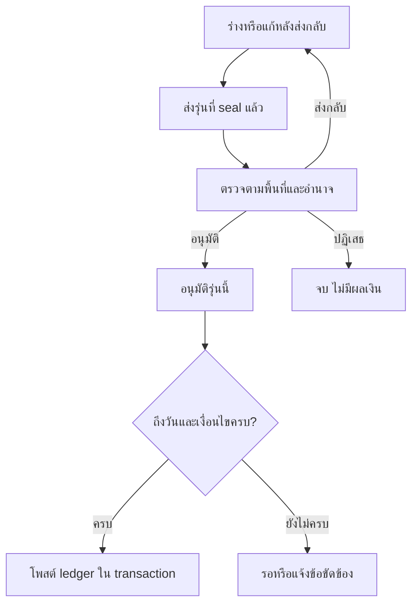

# การอนุมัติแผนและปรับงบ — บท 42

รุ่น 0.1 | 5 ตุลาคม 2569 (2026-10-05) | source `80e0331` | **Proposal / BLOCKED / PLAN ONLY**

## 1 Workflow กลางและอำนาจ

ใช้ WorkflowDefinition/WorkflowInstance/StepDecision/AuditEvent/outboxจากบท11เมื่อมีจริง ไม่สร้าง budget login หรือ engine ใหม่ Use casesเสนอต่อ REQ-S06: แผน [BUDGET_PLANNING](BUDGET_PLANNING.md) และปรับจัดสรร [ALLOCATION_LEDGER](ALLOCATION_LEDGER.md) Document/FileVersion/scan/ACLกลางจาก10ทุกขั้น รวมworker

authority configต้อง pinรุ่น แยก org/FY/source/category/action/amount bands/decision steps/delegation/effective window นโยบายแหล่งเงิน cross-context restrictions และหลักฐานผู้มีอำนาจยังQ005/Q006/Q010/Q019/TO VERIFY technicaladmin/ServiceActorไม่ได้อำนาจการเงิน Unknown/expired/revoked/หลักฐานไม่ครบต้องdenyงานใหม่ DEMOในfixtureไม่ให้official grant ผู้ตรวจ/ผู้อนุมัติต้องคนละคนกับ maker/submitter/material editor; ไม่เดาว่าผู้ตรวจต้องแยกผู้อนุมัติทุกกรณีจนpolicyยืนยัน

## 2 Transition ที่เสนอ

| จาก                          | Action / ไป              | Guards และผล                                                                                          |
| ---------------------------- | ------------------------ | ----------------------------------------------------------------------------------------------------- |
| draft                        | save / draft             | current maker/editor scope, expected revision, audit; ไม่เพิ่ม ledger                                 |
| draft / returned             | submit / submitted       | requirementsครบ scan/CLEAN/currentACL policy และseal hash ใหม่; workflow/receipt/audit/outbox atomic  |
| submitted                    | claim/review / reviewing | current reviewer grant/delegationช่วงวันที่; ไม่เป็น approval และไม่ผูกgrantจากclaim                  |
| reviewing                    | return / returned        | reason requiredและรายการข้อผิดพลาด; คง decision/submissionเก่า correctionสร้างรุ่นใหม่                |
| reviewing                    | recommend / reviewing    | ความเห็นผูกhashที่อ่าน ผู้ตรวจไม่โพสต์เงิน                                                            |
| reviewing                    | approve / approved       | current approverทุกscope/วงเงิน/evidence/hash/revision maker checker; หนึ่งdecisionต่อstep/submission |
| reviewing                    | reject / rejected        | ผู้มีอำนาจ reason/evidence; ไม่มี ledger effect                                                       |
| draft / submitted / returned | cancel / cancelled       | authorityตามpolicyและreason; ไม่ลบ audit; approvedต้องใช้คำขอแก้/กลับรายการ                           |
| approved                     | activate / effective     | ถึงวันมีผล current approval/grants/policy/evidence/context/balance; ผ่านposting transactionเท่านั้น   |

Draft/edit ใช้ row_version ส่วน approved payload pin business version/decision hash แยก request status จาก plan lifecycle และ posted allocation status ใน UI แผน approvedยังไม่มี allocationอาจเสนอจองไม่ได้ และ queryfutureไม่เป็นใช้เงินได้จริง

## 3 ช่องทางที่ต้องตรวจจริง

| ช่องทาง                                | สิ่งที่ server ต้องตรวจ                                                                                                         |
| -------------------------------------- | ------------------------------------------------------------------------------------------------------------------------------- |
| list/detail/review/report/export/print | current account/grant/scope/field purposeทุกorg/FY/sourceและline; pagination/filterไม่หลุดscope                                 |
| save/submit/correct                    | trusted actor, revision, target context, typed requirements, idempotency hash, CLEAN files                                      |
| approve/reject/return/activate         | action-specific grant/delegation now, maker/editor identities, sealed hash/step version, currency/amount bands, policy evidence |
| evidence download/preview              | central ACLและscanทุกครั้ง ไม่ส่งobject keyหรือissuedsignedlinkลงpublic; ลิงก์ที่ออกแล้วไม่อ้างrevokeทันที                      |
| queued job / receipt replay            | current grants/approval/evidenceตรวจซ้ำ ไม่ใช้สิทธิ์เก่าจากenqueueหรือreceiptเป็นgrant                                          |

Server Actions, Route Handlers, DAL, workerเรียกsharedpolicy deny by defaultแต่ละ boundary Browserdisableปุ่มไม่เป็นauthorization เปลี่ยนorg_id/plan_id/line_id/source/destination/decision_id/policy_idในURL/body/queryต้องไม่เพิ่มสิทธิ์ Cross-unittransferต้องมีgrantทั้งสองฝั่งจากนโยบายที่ยืนยัน หากทำไม่ได้deny ไม่แสดงยอดปลายทางนอกscope

Optimistic revisionป้องกันอนุมัติข้อมูลที่แก้หลังเปิดหน้า decision CASภายใต้transactionและunique(step,submission_version)ทำให้สองผู้อนุมัติมีหนึ่งผล อีกคนได้ conflict ไม่สร้างสองallocationevents Workerไม่เลือกอนุมัติแทนผู้มีอำนาจ

## 4 จุดต่อการจองงบและเกณฑ์ตรวจรับ

Contract `assertReservableLine` เป็น interfaceเสนอ ยังไม่มีฟังก์ชันจริง ต้องตรวจ approved plan/sealed version, allocationที่postedมีผลจริง, period/window/source restrictions, current account/role/scope, availableที่lockแล้วและrevision; draft/returned/rejected/cancelled/unpostedfutureให้deny ไม่มี statusflagจากclientทำให้ผ่าน ต้องใช้lockและconstraintsเดียวกับpostingเมื่อบริการจองถูกพัฒนา ไม่เปิดฟีเจอร์จองใหม่ใน42

| เกณฑ์ผู้ใช้                                   | กรณีตามfixture              | ผลรอบ42                                                    |
| --------------------------------------------- | --------------------------- | ---------------------------------------------------------- |
| 42-01 แผนไม่อนุมัติจองไม่ได้                  | P42-01/02/03/15             | BLOCKED / NOT RUN — ยังไม่มี plan/reservation DAL/API      |
| 42-02 โอนแข่งหรือเกินยอดถูกฐานและบริการปฏิเสธ | P42-06/07/08/09/10/11/14/16 | BLOCKED / NOT RUN — ไม่มี ledger constraints/RPC/native DB |

P42-01–18ใน [fixture plan](fixtures/budget-42-plan.json) ทุกกรณี NOT RUN ต้องเพิ่มnative concurrency/directwrite negative tests, authenticatedAPI tests, full UI flow/a11y/report/evidence testsเมื่อprerequisiteพร้อม วิธีตรวจและคำสั่งที่มีจริงอยู่ [BUDGET_PLANNING](BUDGET_PLANNING.md) ไม่มีผู้เชี่ยวชาญการเงินยืนยันpolicyหรือUATsignoffรอบนี้

Failure recovery: stale revisionให้โหลด/ตรวจใหม่; insufficient availableให้เสนอยอดใหม่และตรวจรุ่นใหม่; hash mismatchห้ามโพสต์; scan/revoke/periodclosedให้หยุดก่อนcommit; DB rollbackใช้keyเดิมretryเฉพาะtransient; workerหยุดหลังcommitกลับมาอ่านreceipt/eventเดิม; คำสั่งผิดใช้คำขอแก้และcompensatingeventพร้อมผลกระทบ ไม่ลบประวัติ
