# ERD และขอบเขตแบบข้อมูล — เว็บไซต์กองบริหารทะเบียนและวัดผล

บท 04 | รุ่นเอกสาร 1.4 | 3 ตุลาคม2569 (2026-10-03) | PROPOSAL / LOGICAL DESIGN ONLY

## 1 แนวคิดและฐานบทเรียน

ERD คือภาพว่าข้อมูลชุดไหนเชื่อมกันด้วยรหัสใด ไม่ใช่หน้าจอ และยังไม่ใช่ฐานข้อมูลที่สร้างแล้ว ฐานบท02 `134cf16` และบท03 `10adf9a` มีrequirements/สิทธิ์/ผังหน้าแล้ว; BROWSER-03ด้านภาพและแป้นพิมพ์จริงยังค้าง ไม่ใช่dependencyของการออกแบบข้อมูลนี้

แบบเต็มประกอบด้วย [DATA_DICTIONARY](DATA_DICTIONARY.md) ทุกฟิลด์, [data_model.json](data_model.json) ทุกPK/FK/unique/index/class และ [DATA_CLASSIFICATION](DATA_CLASSIFICATION.md) พร้อมDTO ข้างล่างเป็นภาพแยกตามมุมงาน ไม่วาด128ตารางอัดภาพเดียว **บัญชีFKเต็มท้ายเอกสารครอบคลุมทุกตาราง** รูปย่อไม่ได้แทนFKที่เหลือ

ทุกชื่อ/โครงตาราง/ชนิดข้อมูลเป็นProposal ข้อกำหนดแชร์ข้อมูล9ระบบ denybydefault ประวัติ snapshot exactdecimal และไม่ลบข้อมูลจริงเป็นConfirmed กฎทางการยังTO VERIFY/Needs Legal Review Q001–Q025 ไม่มีschema/migration/RLS/policiesจริง ไม่มีการเปลี่ยนฐานข้อมูลผ่านDashboard

## 2 ข้อมูลกลางและการแยกขอบเขต

| ข้อมูลกลาง | หน้าที่/ผู้ดูแลเสนอ | สิ่งที่ไม่รวมแทนกัน |
| --- | --- | --- |
| Person | ตัวตนเดียว O01; ตำแหน่ง/ผู้สอน/ผู้เรียน/ผู้สมัครอ้างรหัสนี้ | UserAccount, enrollment, candidateไม่เก็บPersonใหม่หรือชื่อเป็นkey |
| Organization | หน่วย/สถานที่กลาง O02 ใช้กับงบ คลัง หนังสือ สนาม | geographyไม่เท่ากับสายปกครองหรือสังกัดการศึกษา |
| AcademicYear / ExamSession | ปีศึกษาและรอบร่วม O02/O05 | FiscalYearเป็นอีกตาราง ไม่deriveจากปีศึกษา |
| ExamCenter / CenterSession | สถานที่ถาวรกับการเปิดรอบต่างกัน | center_session_levelหลายระดับ; ประธาน/ผู้รับผูกcenter_session+Personตามเวลา |
| Document / FileVersion / ACL | หลักฐานกลาง C02/O08; ติดต่อ/ข่าว/ดาวน์โหลด C04ใช้แหล่งกลาง | ไม่คัดลอกเอกสาร คำสั่ง หรือcontact/loginไป9ระบบ |
| Workflow / Audit / OperationReceipt | engineกลาง C02; อำนาจแต่ละเรื่องจากเจ้าของ | ผู้ดูแลเทคนิคไม่approve/publishโดยroleเอง; importerไม่อนุมัติสอบ |

ภูมิศาสตร์ใช้geography+organization_location; สายปกครองและสังกัดการศึกษาใช้organization_relationที่มีrelation_typeต่างกัน; อำนาจใช้scope+role_assignmentพร้อมเวลา ไม่ใช้geography_idหรือจังหวัดเป็นสิทธิ์ จังหวัดสมมติเดียวมีสายA/Bที่ไม่เห็นกันได้ คนมีหลายสังกัดไม่ทำให้เจ้าหน้าที่เห็นข้อมูลทุกบทบาทของคนนั้น ต้องตรวจแต่ละแถว/fieldตามโมดูลและภารกิจ

## 3 ประวัติและsnapshot

ประวัติ12ตารางใช้ช่วง `[effective_from,effective_to)` ในวันธุรกิจไทย และ `recorded_at` + `superseded_at` เป็นเวลาที่องค์กรทราบข้อมูล เลือกณวันธุรกิจDและเวลาความรู้Tโดย effective_from<=D และ D<effective_toถ้ามี พร้อม recorded_at<=T และ T<superseded_atถ้ามี

แก้วัน/ชื่อที่บันทึกผิด: transactionเพิ่มรุ่นแทน/รุ่นแบ่งช่วงและหลักฐาน อ้างreplaces_id แล้วstamp superseded_atของรุ่นเดิมเท่านั้น ไม่แก้originalname/intervalทับ จบหน้าที่: เพิ่มtimelineรุ่นที่ปิดช่วงอย่างตรวจย้อนกลับได้ snapshotเก่าชี้sourcehistoryidเดิมและเก็บข้อความที่ใช้จริง จึงยังอ่านปีเก่าได้แม้ข้อมูลปัจจุบันแก้

nonoverlapบังคับเฉพาะkeyที่dictionaryระบุในcurrentknowledge ไม่สมมติว่าหนึ่งคนมีได้เพียงหนึ่งหน้าที่ ไม่สมมติประธานได้หนึ่งคนต่อรอบโดยไม่มีระเบียบ จำนวนผู้ถือครอง/หน้าที่ซ้อนที่กฎทางการจำกัดต้องconfigurationที่รับรองQ024 ถ้าตัวtargetnullableเช่นstatus_eventใช้partialexclusionแยกองค์กร/center ไม่ปล่อยNULLทำให้กฎรั่ว

change_request/request_versionเป็นข้อเสนอ; decisionเป็นคำตัดสิน; status_event/person_status_eventและactivation_recordเป็นสิ่งที่มีผล การอนุมัติอนาคตไม่เปลี่ยนทะเบียนก่อนวันจริง activationต้องตรวจgrant/policy/ผลกระทบอีกครั้งและreceiptไม่ซ้ำ

application_snapshotเก็บชื่อ/สังกัด/ที่อยู่หน่วยงานพร้อมsourcehistory/captured_at/source_effective_on result_release_itemคัดsnapshotที่รับรอง immutable คะแนนทางการใช้subject_scoreรุ่นที่result_score_linkตรึง ไม่ใช้latestscoreหรือattempt/responseฝึกเป็นinputผลทางการ

exam_center_appointmentมีsourcehistoryและsnapshotชื่อ/สังกัด/ที่อยู่ส่ง โดยอ้างcenter_session ผู้รับข้อสอบไม่ได้answer_key ACLจากหน้าที่นี้

## 4 PK FK unique และข้อบังคับสำคัญ

| เรื่อง | แบบบังคับเสนอ | ต้องพิสูจน์เมื่อimplementation |
| --- | --- | --- |
| ตัวตน | person_codeunique; identifierHMACเมื่อมีสิทธิ์และหลักฐาน; ชื่อเหมือนเป็นcandidate duplicate_reviewไม่mergeอัตโนมัติ | การสมัครคนเดิมใช้Personเดิม คนชื่อเหมือนต่างคนไม่ถูกmerge |
| บัญชี | auth_user_iduniqueอ้างauth.usersPK; personbindingหลังตรวจตัวตน; activePersonbindinguniqueเสนอQ023 | P01ไม่เกิดก่อนbinding ไม่มีpasswordอีกชุด |
| ใบสมัคร | unique(person_id,session_level_id)ProposalQ024 ร่วมเว็บ/Excel; compositeFKยืนยันcandidate/enrollment/สนามเป็นคน/รอบเดียว | ปลอมperson/หน่วย/rอบในpayloadไม่สำเร็จ กดซ้ำไม่มีใบสมัครเพิ่ม |
| สนาม | unique(center,session) และ unique(center_session,session_level) พร้อมcontext compositeFK | หนึ่งสนามหลายปี/ระดับได้ แต่ผูกระดับคนละรอบไม่ได้ |
| ประวัติ | exclusionตามkey/currentknowledgeพร้อม[)และindexเวลา; extension/versionรอQ023 | จองช่วงพร้อมกันไม่เกิดทับผิดกฎและqueryasofได้ |
| workflow | typedFKหนึ่งtargetต่อcase; partialuniqueรายtarget/round; actorจากsession | ห้ามcreatorapproveเอง และrevisionที่ไม่ตรงถูก409 |
| ACL | principalaccountหรือscopeหนึ่งแบบ; partialuniqueแยกNULLfileversion; compositeFKfileversion+document | grantของไฟล์เรื่องอื่นไม่ทำให้อ่านเรื่องนี้ได้ |
| ผล | unique(draft,application), (draftitem,session_subject) และcompositeFKscore/snapshot/releasecontext | ไม่มีผลคนเดียวซ้ำจากsnapshotต่างรุ่น และไม่เอาคะแนนคนอื่นมาผูก |
| Ledger/stock | receiptunique + eventlineunique + orderedlocksบนยอดต้นทางปลายทาง | atomicconcurrency/retry/negativebalance/policy/periodlockด้วยPostgreSQLจริง |

FKทุกbusinessrelationshipมีRESTRICT ดัชนีFK/queryระบุในdictionary ข้ามแถวอย่างcycle/ยอด/capacity/authorityใช้transaction/RPC ไม่ใส่CHECKข้ามtable โดยเฉพาะUPDATEตรวจold/newscopeและทุกlineไม่เฉพาะheader scope เอกสารRLSทุกtableและprivate schemaเป็นข้อเสนอ ต้องmigrationและnegative testsจริงก่อนรับรอง

## 5 ภาพความสัมพันธ์แยกมุม

### ภาพ 01 — บัญชีแยกจากตัวตนและสิทธิ์

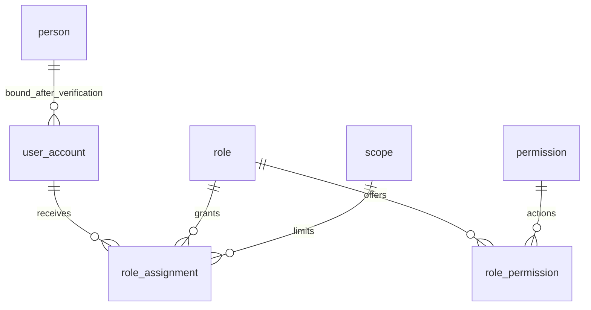

### ภาพ 02 — ข้อมูลกลางเอกสารและงานที่กดซ้ำ

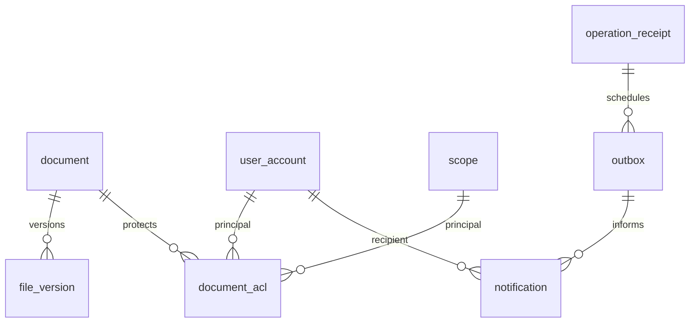

### ภาพ 03 — ระบบ01 คนเดียวหลายหน้าที่และประวัติ

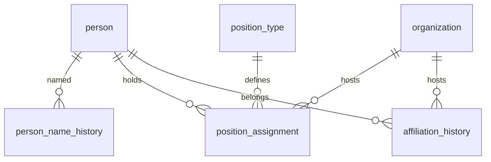

### ภาพ 04 — ระบบ02 ภูมิศาสตร์แยกสายและscope

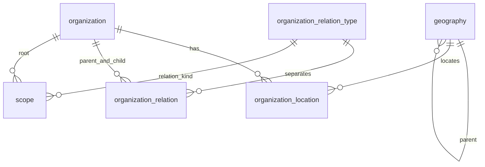

### ภาพ 05 — ระบบ02 ปีรอบและหลายระดับ

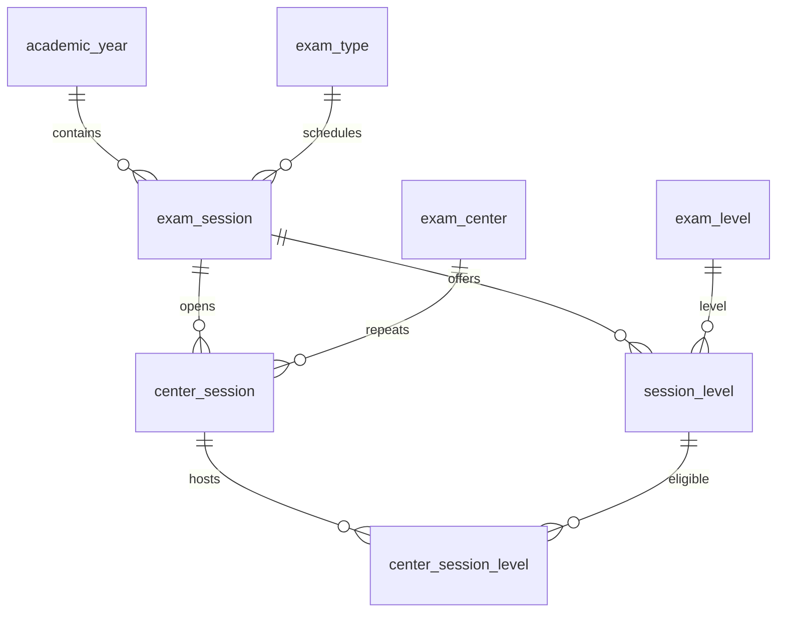

### ภาพ 06 — ระบบ02 ประธานและผู้รับรายรอบไม่ทับปีเก่า

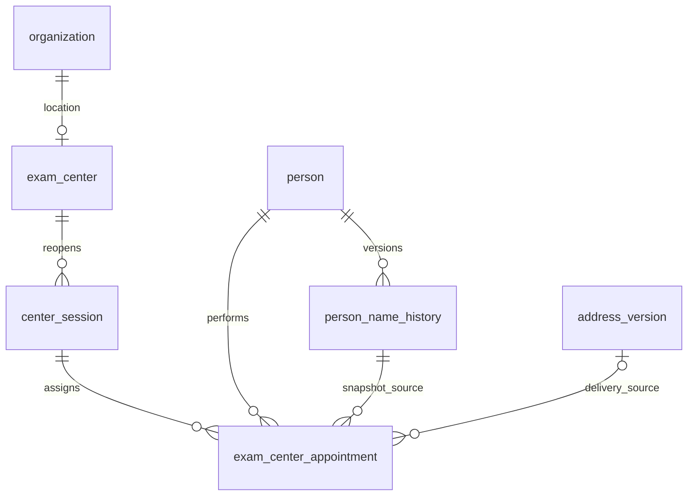

### ภาพ 07 — ระบบ03 หลักสูตรและคะแนนฝึก

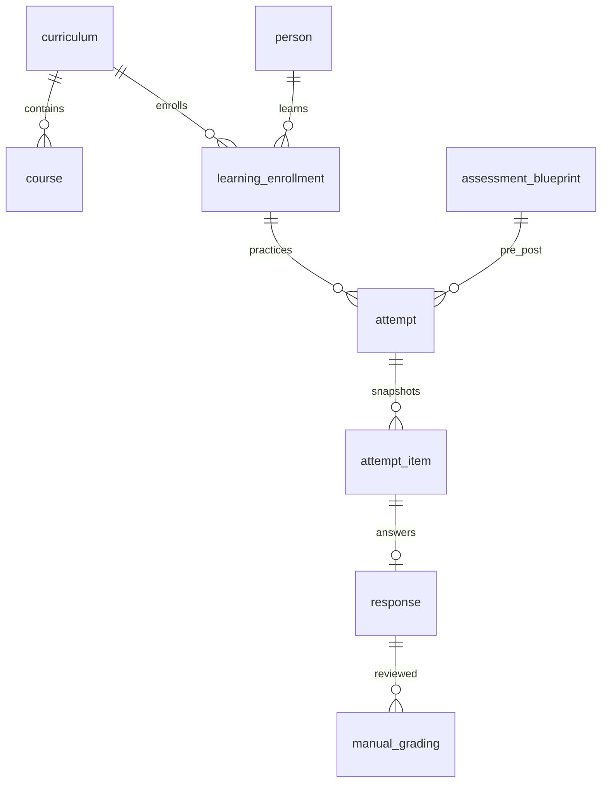

### ภาพ 08 — ระบบ04 คำขอกับการมีผลแยกกัน

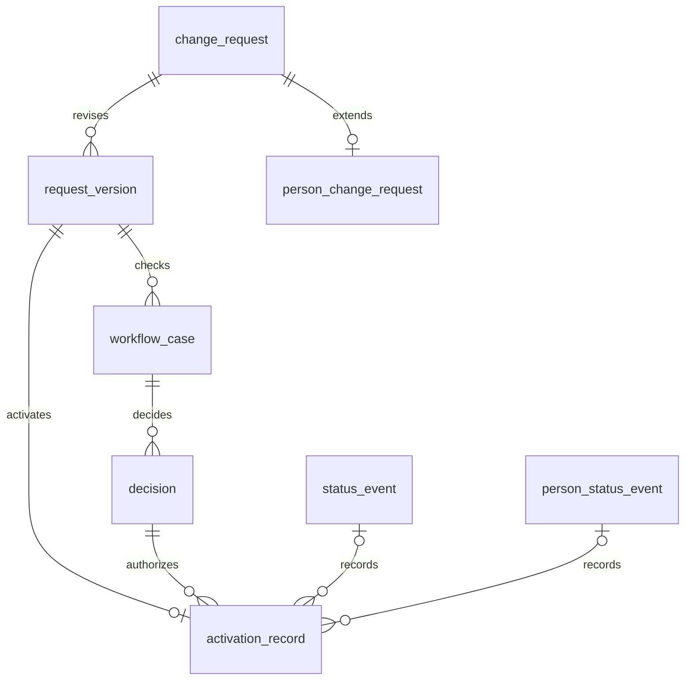

### ภาพ 09 — ระบบ05 สมัครจากPersonเดียวและsnapshot

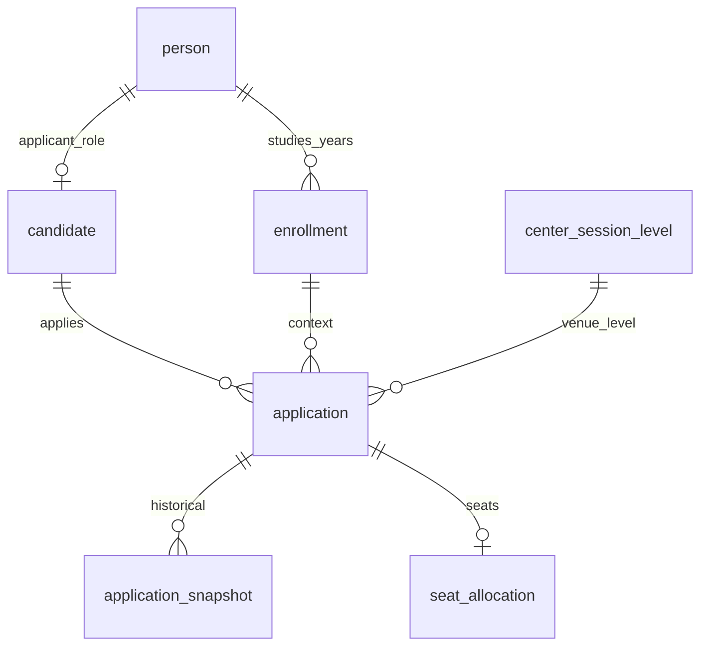

### ภาพ 10 — ระบบ05 คะแนนรับรองและเผยแพร่แยกฝึก

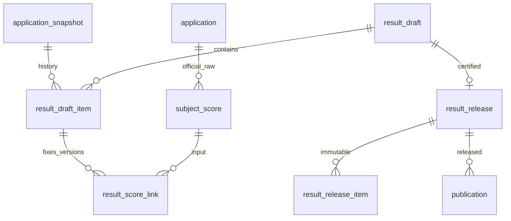

### ภาพ 11 — ระบบ06 ledgerหนึ่งชุด

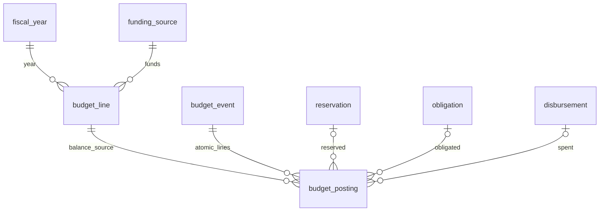

### ภาพ 12 — ระบบ07 ขอซื้อและรับของแยกจ่าย

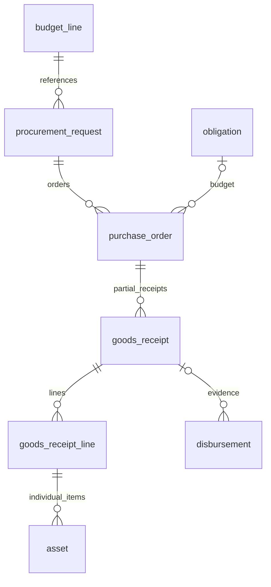

### ภาพ 13 — ระบบ07 จำนวนวัสดุและผู้ถือครองครุภัณฑ์

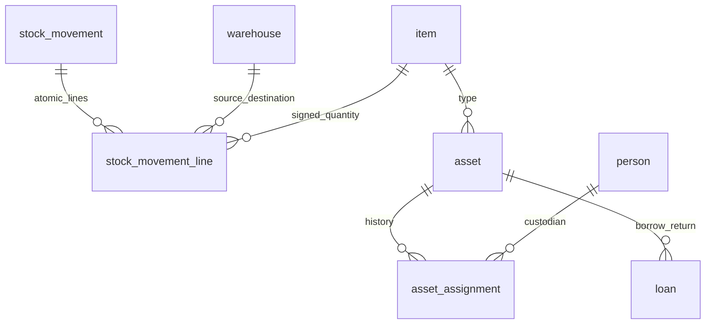

### ภาพ 14 — ระบบ08 เรื่องรุ่นและรับทราบชัดเจน

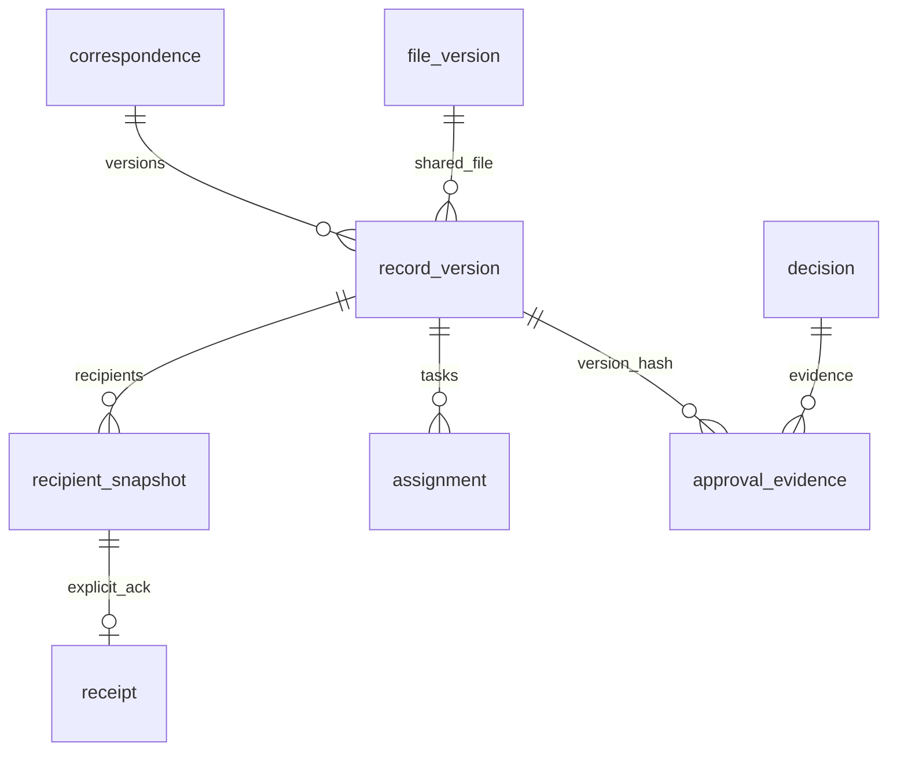

### ภาพ 15 — ระบบ09 Excelไม่เป็นใบสมัครอีกชุด

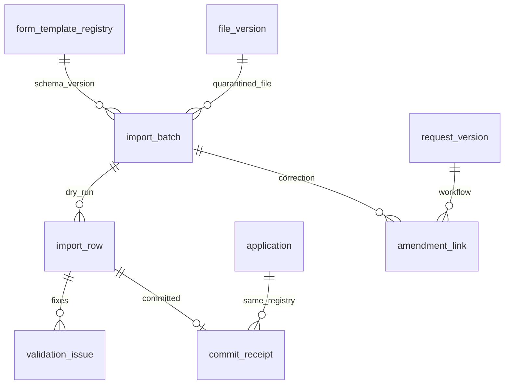

## 6 งบและวัสดุเป็นledgerชุดเดียวต่อด้าน

งบนี้เป็นบัญชีdeltaของสถานะงบ ไม่อ้างว่าเป็นผังบัญชีราชการแบบdoubleentryจนQ010รับรอง budget_eventเป็นหัวธุรกรรม budget_postingเป็นsigneddeltaของallocated/reserved/obligated/spent ยอดคงเหลือ = allocated - reserved - obligated - spent โดยsumเฉพาะposted ไม่มีcacheอีกตารางเป็นยอดจริง

| เหตุการณ์ทดลอง | deltaที่โพสต์ในtransactionเดียว | ยอดที่ไม่ทับกันหลังโพสต์ | คงเหลือ |
| --- | --- | --- | --- |
| จัดสรร100000.00 | allocated +100000.00 | allocated100000.00 | 100000.00 |
| จอง20000.00 | reserved +20000.00 | reserved20000.00 | 80000.00 |
| เปลี่ยนจองเป็นผูกพัน20000.00 | reserved -20000.00; obligated +20000.00 | reserved0.00 obligated20000.00 | 80000.00 |
| จ่าย5000.00 | obligated -5000.00; spent +5000.00 | obligated15000.00 spent5000.00 | 80000.00 |

เงินส่งเป็นdecimalstring ไม่ผ่านJSNumberสำหรับการคำนวณเงิน ปฏิเสธทศนิยมเกินscale/NaN/Infinityก่อนcastเพื่อไม่ปัดโดยเงียบ ล็อกbudget_lineตามลำดับid ตรวจยอด+ปีงบ+แหล่งเงิน+period+อำนาจทุกline แล้วโพสต์journal/audit/outbox/receiptร่วมtransaction keyเดิม+payloadเดิมคืนreceiptเดิม keyเดิม+payloadต่าง409 ความละเอียดmoney/quantity/scoreเป็นProposalQ024 ไม่ใช่ค่าทางการ

reservation/obligation/disbursementเป็นรายละเอียดเอกสาร ไม่sumจำนวนจากsubtypeซ้ำกับposting การกลับรายการสร้างeventใหม่ที่อ้างต้นเรื่องและdeltaตรงข้าม ไม่ลบpostedline ค่าภาษี วงเงิน เกณฑ์ซื้อ ค่าเสื่อม กฎข้ามปี/ข้ามแหล่งเงินยังTO VERIFY

procurement_request→budget_line; reservation→procurement_request; obligation↔purchase_order; goods_receipt→purchase_order; disbursementอ้างobligationและหลักฐานรับได้ตามpolicy การรับของไม่บันทึกจ่ายเอง วัสดุsumquantity_deltaในstock_movement_lineต่อwarehouse/item; transferคู่+/-ในtransactionเดียว ครุภัณฑ์assetเป็นรายชิ้นอ้างgoods_receipt_line มีประวัติPerson/ยืมคืน ไม่ใช้ledgerเงินหรือวัสดุแทนทะเบียนasset

## 7 เกณฑ์ตรวจรับด้วยข้อมูลสมมติ

| รหัส | สถานการณ์ | ผลที่ต้องได้/หลักฐานบทนี้ |
| --- | --- | --- |
| DATA-04-01 | Person P1มีหน้าที่ผู้สอนทดลองและเจ้าหน้าที่ทดลอง และเป็นcandidateหนึ่งราย สมัครสองปี | referencesทุกบทบาท/candidate/enrollment/applicationใช้Personidเดียว ไม่มีสร้างperson_teacher/person_applicant; fixtureตรวจUUIDและunique |
| DATA-04-02 | ExamCenter C1เปิดรอบปี2568และ2569 ปี2569มีสองระดับ ประธาน/ผู้รับเปลี่ยน | centerเดิม center_session2รายการ center_session_level3รายการ appointmentsรายรอบ; snapshotปี2568คงเดิมหลังข้อมูลปัจจุบันเปลี่ยน |
| DATA-04-03 | หน่วยA/Bอยู่geographyเดียวแต่คนละrelationbranch; accountAมีscopeเฉพาะA | โครงสร้างไม่ใช้geographyเป็นgrant; เงื่อนไขscopeจำลองไม่รวมB ไม่ใช่ผลRLSจริง |
| DATA-04-04 | snapshotชื่อ/สังกัดปี2568 แล้วเพิ่มnamehistoryปี2569 | ข้อความและFKsourceในsnapshotเก่าเท่าเดิม; asofbusinessdate/recordedtimeเลือกถูก |
| DATA-04-05 | decimalledgerจัดสรร→จอง→ผูกพัน→จ่ายบางส่วนและretrykey | คงเหลือ80000.00ตลอดสามขั้นหลังจอง ไม่หักจองซ้ำ; fixturesใช้Decimalและreceiptจำลอง ไม่ใช่DBtransactiontest |
| DATA-04-06 | DTO policyพยายามใส่เลขประชาชน/วันเกิด/เบอร์/ที่อยู่ส่วนตัว/filekey/เฉลย | allowlist/denylistออกแบบreject; tableHไม่เผยแพร่; fixturesตรวจshape ไม่ใช่APIprivacytest |

เครื่องมือตรวจเอกสาร/fixturesรันจริงบันทึกในPROGRESS ตัวอย่างไม่สร้างseedDBหรือข้อมูลบุคคลจริง การรันPostgreSQL/FK/RLS/ACL/concurrency/restoreและruntimeTC90กรณีบท02ยังNOT RUN

## 8 บัญชีความสัมพันธ์เต็มทุกตาราง

คอลัมน์ตัวชี้audit/notificationและStorageAPIอธิบายในdictionary ไม่แสดงเป็นFKปลอม ทุกFKปกติ/compoundมีtargetและunique/indexที่ตรวจจากdata_model.json ประวัติ self-replacesเป็นFKจริง รูป15ภาพข้างต้นเป็นมุมย่อ บัญชีนี้เป็นERDเชิงตรรกะเต็ม

| ตาราง | หมวด | FKทั้งหมดของตาราง | compoundFK/ข้อจำกัดเพิ่ม |
| --- | --- | --- | --- |
| user_account | 00 | created_by → user_account.id; updated_by → user_account.id; auth_user_id → auth.users.id; person_id → person.id | ตามPK/unique/checkในdictionary |
| role | 00 | created_by → user_account.id; updated_by → user_account.id | ตามPK/unique/checkในdictionary |
| permission | 00 | created_by → user_account.id; updated_by → user_account.id | ตามPK/unique/checkในdictionary |
| role_permission | 00 | created_by → user_account.id; updated_by → user_account.id; role_id → role.id; permission_id → permission.id | ตามPK/unique/checkในdictionary |
| scope | 00 | created_by → user_account.id; updated_by → user_account.id; root_organization_id → organization.id; relation_type_id → organization_relation_type.id; exam_session_id → exam_session.id; center_session_id → center_session.id; warehouse_id → warehouse.id; funding_source_id → funding_source.id; fiscal_year_id → fiscal_year.id | ตามPK/unique/checkในdictionary |
| role_assignment | 00 | created_by → user_account.id; updated_by → user_account.id; user_account_id → user_account.id; role_id → role.id; scope_id → scope.id; policy_version_id → policy_version.id; evidence_document_id → document.id; granted_by → user_account.id | ตามPK/unique/checkในdictionary |
| policy_version | 00 | created_by → user_account.id; updated_by → user_account.id; evidence_document_id → document.id; verified_by → user_account.id | ตามPK/unique/checkในdictionary |
| document | 00 | created_by → user_account.id; updated_by → user_account.id; owner_organization_id → organization.id; retention_policy_id → policy_version.id | ตามPK/unique/checkในdictionary |
| file_version | 00 | created_by → user_account.id; updated_by → user_account.id; document_id → document.id; scan_policy_version_id → policy_version.id | ตามPK/unique/checkในdictionary |
| document_acl | 00 | created_by → user_account.id; updated_by → user_account.id; document_id → document.id; file_version_id → file_version.id; user_account_id → user_account.id; scope_id → scope.id; permission_id → permission.id; evidence_document_id → document.id | (file_version_id, document_id) → file_version(id, document_id) |
| operation_receipt | 00 | recorded_by → user_account.id; initiating_account_id → user_account.id | ตามPK/unique/checkในdictionary |
| audit_logs | 00 | recorded_by → user_account.id; actor_account_id → user_account.id; initiating_account_id → user_account.id; policy_version_id → policy_version.id | ตามPK/unique/checkในdictionary |
| outbox | 00 | created_by → user_account.id; updated_by → user_account.id; operation_receipt_id → operation_receipt.id; initiating_account_id → user_account.id | ตามPK/unique/checkในdictionary |
| notification | 00 | created_by → user_account.id; updated_by → user_account.id; recipient_account_id → user_account.id; outbox_id → outbox.id | ตามPK/unique/checkในdictionary |
| publication_policy | 00 | created_by → user_account.id; updated_by → user_account.id; policy_version_id → policy_version.id | ตามPK/unique/checkในdictionary |
| publication | 00 | recorded_by → user_account.id; person_id → person.id; organization_id → organization.id; curriculum_id → curriculum.id; result_release_id → result_release.id; record_version_id → record_version.id; site_content_id → site_content.id; news_post_id → news_post.id; download_entry_id → download_entry.id; publication_policy_id → publication_policy.id; approval_decision_id → decision.id; published_by → user_account.id; source_person_name_history_id → person_name_history.id; source_organization_name_history_id → organization_name_history.id | ตามPK/unique/checkในdictionary |
| site_content | 00 | created_by → user_account.id; updated_by → user_account.id; organization_id → organization.id; evidence_document_id → document.id | ตามPK/unique/checkในdictionary |
| news_post | 00 | created_by → user_account.id; updated_by → user_account.id; site_content_id → site_content.id | ตามPK/unique/checkในdictionary |
| download_entry | 00 | created_by → user_account.id; updated_by → user_account.id; file_version_id → file_version.id; form_template_id → form_template_registry.id | ตามPK/unique/checkในdictionary |
| person | 01 | created_by → user_account.id; updated_by → user_account.id; merged_into_person_id → person.id | ตามPK/unique/checkในdictionary |
| person_private | 01 | created_by → user_account.id; updated_by → user_account.id; person_id → person.id | ตามPK/unique/checkในdictionary |
| person_identifier | 01 | created_by → user_account.id; updated_by → user_account.id; person_id → person.id; evidence_document_id → document.id | ตามPK/unique/checkในdictionary |
| person_name_history | 01 | recorded_by → user_account.id; evidence_document_id → document.id; replaces_id → person_name_history.id; person_id → person.id | ตามPK/unique/checkในdictionary |
| education_branch | 01 | created_by → user_account.id; updated_by → user_account.id | ตามPK/unique/checkในdictionary |
| position_type | 01 | created_by → user_account.id; updated_by → user_account.id; education_branch_id → education_branch.id; policy_version_id → policy_version.id | ตามPK/unique/checkในdictionary |
| position_assignment | 01 | recorded_by → user_account.id; evidence_document_id → document.id; replaces_id → position_assignment.id; person_id → person.id; organization_id → organization.id; position_type_id → position_type.id; source_request_id → change_request.id | ตามPK/unique/checkในdictionary |
| affiliation_history | 01 | recorded_by → user_account.id; evidence_document_id → document.id; replaces_id → affiliation_history.id; person_id → person.id; organization_id → organization.id; relation_type_id → organization_relation_type.id; source_request_id → change_request.id | ตามPK/unique/checkในdictionary |
| person_status_event | 01 | recorded_by → user_account.id; evidence_document_id → document.id; replaces_id → person_status_event.id; person_id → person.id; source_request_version_id → request_version.id; policy_version_id → policy_version.id | ตามPK/unique/checkในdictionary |
| person_change_request | 01 | created_by → user_account.id; updated_by → user_account.id; change_request_id → change_request.id; person_id → person.id | ตามPK/unique/checkในdictionary |
| geography | 02 | created_by → user_account.id; updated_by → user_account.id; parent_geography_id → geography.id | ตามPK/unique/checkในdictionary |
| organization_type | 02 | created_by → user_account.id; updated_by → user_account.id | ตามPK/unique/checkในdictionary |
| organization_relation_type | 02 | created_by → user_account.id; updated_by → user_account.id; policy_version_id → policy_version.id | ตามPK/unique/checkในdictionary |
| organization | 02 | created_by → user_account.id; updated_by → user_account.id; organization_type_id → organization_type.id; merged_into_organization_id → organization.id | ตามPK/unique/checkในdictionary |
| organization_name_history | 02 | recorded_by → user_account.id; evidence_document_id → document.id; replaces_id → organization_name_history.id; organization_id → organization.id | ตามPK/unique/checkในdictionary |
| organization_relation | 02 | recorded_by → user_account.id; evidence_document_id → document.id; replaces_id → organization_relation.id; parent_organization_id → organization.id; child_organization_id → organization.id; relation_type_id → organization_relation_type.id; source_request_id → change_request.id | ตามPK/unique/checkในdictionary |
| address_version | 02 | recorded_by → user_account.id; evidence_document_id → document.id; replaces_id → address_version.id; organization_id → organization.id; geography_id → geography.id | ตามPK/unique/checkในdictionary |
| organization_location | 02 | recorded_by → user_account.id; evidence_document_id → document.id; replaces_id → organization_location.id; organization_id → organization.id; geography_id → geography.id | ตามPK/unique/checkในdictionary |
| organization_contact | 02 | recorded_by → user_account.id; evidence_document_id → document.id; replaces_id → organization_contact.id; organization_id → organization.id | ตามPK/unique/checkในdictionary |
| academic_year | 02 | created_by → user_account.id; updated_by → user_account.id; policy_version_id → policy_version.id | ตามPK/unique/checkในdictionary |
| exam_type | 02 | created_by → user_account.id; updated_by → user_account.id | ตามPK/unique/checkในdictionary |
| exam_level | 02 | created_by → user_account.id; updated_by → user_account.id; exam_type_id → exam_type.id | ตามPK/unique/checkในdictionary |
| exam_session | 02 | created_by → user_account.id; updated_by → user_account.id; academic_year_id → academic_year.id; exam_type_id → exam_type.id; policy_version_id → policy_version.id | ตามPK/unique/checkในdictionary |
| session_level | 02 | created_by → user_account.id; updated_by → user_account.id; exam_session_id → exam_session.id; exam_level_id → exam_level.id; exam_type_id → exam_type.id | (exam_level_id, exam_type_id) → exam_level(id, exam_type_id); (exam_session_id, exam_type_id) → exam_session(id, exam_type_id) |
| exam_center | 02 | created_by → user_account.id; updated_by → user_account.id; organization_id → organization.id | ตามPK/unique/checkในdictionary |
| center_session | 02 | created_by → user_account.id; updated_by → user_account.id; exam_center_id → exam_center.id; exam_session_id → exam_session.id; status_event_id → status_event.id | ตามPK/unique/checkในdictionary |
| center_session_level | 02 | created_by → user_account.id; updated_by → user_account.id; center_session_id → center_session.id; session_level_id → session_level.id; exam_session_id → exam_session.id | (center_session_id, exam_session_id) → center_session(id, exam_session_id); (session_level_id, exam_session_id) → session_level(id, exam_session_id) |
| exam_center_appointment | 02 | recorded_by → user_account.id; evidence_document_id → document.id; replaces_id → exam_center_appointment.id; center_session_id → center_session.id; person_id → person.id; person_name_history_id → person_name_history.id; affiliation_history_id → affiliation_history.id; address_version_id → address_version.id; organization_name_history_id → organization_name_history.id | ตามPK/unique/checkในdictionary |
| learning_group | 03 | created_by → user_account.id; updated_by → user_account.id | ตามPK/unique/checkในdictionary |
| curriculum | 03 | created_by → user_account.id; updated_by → user_account.id; learning_group_id → learning_group.id; source_document_id → document.id; policy_version_id → policy_version.id | ตามPK/unique/checkในdictionary |
| course | 03 | created_by → user_account.id; updated_by → user_account.id; curriculum_id → curriculum.id | ตามPK/unique/checkในdictionary |
| lesson_version | 03 | created_by → user_account.id; updated_by → user_account.id; course_id → course.id; source_document_id → document.id | ตามPK/unique/checkในdictionary |
| question_version | 03 | created_by → user_account.id; updated_by → user_account.id; course_id → course.id; source_document_id → document.id | ตามPK/unique/checkในdictionary |
| answer_key | 03 | created_by → user_account.id; updated_by → user_account.id; question_version_id → question_version.id | ตามPK/unique/checkในdictionary |
| assessment_blueprint | 03 | created_by → user_account.id; updated_by → user_account.id; curriculum_id → curriculum.id; policy_version_id → policy_version.id | ตามPK/unique/checkในdictionary |
| assessment_item | 03 | created_by → user_account.id; updated_by → user_account.id; assessment_blueprint_id → assessment_blueprint.id; question_version_id → question_version.id | ตามPK/unique/checkในdictionary |
| learning_enrollment | 03 | created_by → user_account.id; updated_by → user_account.id; person_id → person.id; curriculum_id → curriculum.id; academic_year_id → academic_year.id; organization_id → organization.id | ตามPK/unique/checkในdictionary |
| attempt | 03 | created_by → user_account.id; updated_by → user_account.id; learning_enrollment_id → learning_enrollment.id; assessment_blueprint_id → assessment_blueprint.id; policy_version_id → policy_version.id; curriculum_id → curriculum.id | (assessment_blueprint_id, curriculum_id) → assessment_blueprint(id, curriculum_id); (learning_enrollment_id, curriculum_id) → learning_enrollment(id, curriculum_id) |
| attempt_item | 03 | created_by → user_account.id; updated_by → user_account.id; attempt_id → attempt.id; question_version_id → question_version.id | ตามPK/unique/checkในdictionary |
| response | 03 | created_by → user_account.id; updated_by → user_account.id; attempt_item_id → attempt_item.id | ตามPK/unique/checkในdictionary |
| learning_progress | 03 | created_by → user_account.id; updated_by → user_account.id; learning_enrollment_id → learning_enrollment.id; lesson_version_id → lesson_version.id; last_attempt_id → attempt.id | ตามPK/unique/checkในdictionary |
| manual_grading | 03 | recorded_by → user_account.id; response_id → response.id; grader_account_id → user_account.id; answer_key_id → answer_key.id | ตามPK/unique/checkในdictionary |
| change_request | 04 | created_by → user_account.id; updated_by → user_account.id; target_person_id → person.id; target_organization_id → organization.id; target_center_session_id → center_session.id; requester_account_id → user_account.id; policy_version_id → policy_version.id | ตามPK/unique/checkในdictionary |
| request_version | 04 | created_by → user_account.id; updated_by → user_account.id; change_request_id → change_request.id; evidence_document_id → document.id | ตามPK/unique/checkในdictionary |
| workflow_case | 00 | created_by → user_account.id; updated_by → user_account.id; request_version_id → request_version.id; application_id → application.id; result_draft_id → result_draft.id; budget_event_id → budget_event.id; procurement_request_id → procurement_request.id; stocktake_id → stocktake.id; disposal_id → disposal.id; record_version_id → record_version.id; lesson_version_id → lesson_version.id; question_version_id → question_version.id; site_content_id → site_content.id; creator_account_id → user_account.id; policy_version_id → policy_version.id; period_close_id → period_close.id; curriculum_id → curriculum.id | ตามPK/unique/checkในdictionary |
| decision | 00 | recorded_by → user_account.id; workflow_case_id → workflow_case.id; actor_account_id → user_account.id; evidence_document_id → document.id | ตามPK/unique/checkในdictionary |
| impact_assessment | 04 | created_by → user_account.id; updated_by → user_account.id; request_version_id → request_version.id; evidence_document_id → document.id | ตามPK/unique/checkในdictionary |
| status_event | 04 | recorded_by → user_account.id; evidence_document_id → document.id; replaces_id → status_event.id; organization_id → organization.id; center_session_id → center_session.id; source_request_version_id → request_version.id; policy_version_id → policy_version.id | ตามPK/unique/checkในdictionary |
| activation_record | 04 | recorded_by → user_account.id; request_version_id → request_version.id; decision_id → decision.id; status_event_id → status_event.id; person_status_event_id → person_status_event.id; operation_receipt_id → operation_receipt.id | ตามPK/unique/checkในdictionary |
| candidate | 05 | created_by → user_account.id; updated_by → user_account.id; person_id → person.id | ตามPK/unique/checkในdictionary |
| enrollment | 05 | created_by → user_account.id; updated_by → user_account.id; person_id → person.id; organization_id → organization.id; academic_year_id → academic_year.id; education_branch_id → education_branch.id | ตามPK/unique/checkในdictionary |
| eligibility_rule_version | 05 | created_by → user_account.id; updated_by → user_account.id; policy_version_id → policy_version.id; session_level_id → session_level.id | ตามPK/unique/checkในdictionary |
| application | 05 | created_by → user_account.id; updated_by → user_account.id; person_id → person.id; candidate_id → candidate.id; enrollment_id → enrollment.id; session_level_id → session_level.id; center_session_level_id → center_session_level.id; eligibility_rule_version_id → eligibility_rule_version.id; operation_receipt_id → operation_receipt.id | (candidate_id, person_id) → candidate(id, person_id); (enrollment_id, person_id) → enrollment(id, person_id); (center_session_level_id, session_level_id) → center_session_level(id, session_level_id) |
| application_snapshot | 05 | recorded_by → user_account.id; application_id → application.id; person_name_history_id → person_name_history.id; organization_name_history_id → organization_name_history.id; affiliation_history_id → affiliation_history.id; address_version_id → address_version.id | ตามPK/unique/checkในdictionary |
| seat_allocation | 05 | created_by → user_account.id; updated_by → user_account.id; application_id → application.id; center_session_level_id → center_session_level.id; operation_receipt_id → operation_receipt.id | (application_id, center_session_level_id) → application(id, center_session_level_id) |
| exam_subject | 05 | created_by → user_account.id; updated_by → user_account.id | ตามPK/unique/checkในdictionary |
| session_subject | 05 | created_by → user_account.id; updated_by → user_account.id; session_level_id → session_level.id; exam_subject_id → exam_subject.id | ตามPK/unique/checkในdictionary |
| grading_rule_version | 05 | created_by → user_account.id; updated_by → user_account.id; policy_version_id → policy_version.id; session_subject_id → session_subject.id | ตามPK/unique/checkในdictionary |
| subject_score | 05 | recorded_by → user_account.id; application_id → application.id; session_subject_id → session_subject.id; grading_rule_version_id → grading_rule_version.id; source_file_version_id → file_version.id; supersedes_score_id → subject_score.id; session_level_id → session_level.id | (application_id, session_level_id) → application(id, session_level_id); (session_subject_id, session_level_id) → session_subject(id, session_level_id) |
| result_draft | 05 | created_by → user_account.id; updated_by → user_account.id; center_session_level_id → center_session_level.id; policy_version_id → policy_version.id | ตามPK/unique/checkในdictionary |
| result_draft_item | 05 | created_by → user_account.id; updated_by → user_account.id; result_draft_id → result_draft.id; application_snapshot_id → application_snapshot.id; application_id → application.id | (application_snapshot_id, application_id) → application_snapshot(id, application_id) |
| result_score_link | 05 | created_by → user_account.id; updated_by → user_account.id; result_draft_item_id → result_draft_item.id; subject_score_id → subject_score.id; application_id → application.id; session_subject_id → session_subject.id | (result_draft_item_id, application_id) → result_draft_item(id, application_id); (subject_score_id, application_id) → subject_score(id, application_id); (subject_score_id, session_subject_id) → subject_score(id, session_subject_id) |
| result_release | 05 | recorded_by → user_account.id; result_draft_id → result_draft.id; approval_decision_id → decision.id; supersedes_release_id → result_release.id | ตามPK/unique/checkในdictionary |
| result_release_item | 05 | recorded_by → user_account.id; result_release_id → result_release.id; result_draft_item_id → result_draft_item.id; result_draft_id → result_draft.id | (result_release_id, result_draft_id) → result_release(id, result_draft_id); (result_draft_item_id, result_draft_id) → result_draft_item(id, result_draft_id) |
| fiscal_year | 06 | created_by → user_account.id; updated_by → user_account.id; policy_version_id → policy_version.id | ตามPK/unique/checkในdictionary |
| funding_source | 06 | created_by → user_account.id; updated_by → user_account.id; organization_id → organization.id | ตามPK/unique/checkในdictionary |
| project | 06 | created_by → user_account.id; updated_by → user_account.id; organization_id → organization.id | ตามPK/unique/checkในdictionary |
| project_exam_session | 06 | created_by → user_account.id; updated_by → user_account.id; project_id → project.id; exam_session_id → exam_session.id | ตามPK/unique/checkในdictionary |
| budget_line | 06 | created_by → user_account.id; updated_by → user_account.id; organization_id → organization.id; fiscal_year_id → fiscal_year.id; funding_source_id → funding_source.id; project_id → project.id | ตามPK/unique/checkในdictionary |
| budget_event | 06 | created_by → user_account.id; updated_by → user_account.id; organization_id → organization.id; fiscal_year_id → fiscal_year.id; operation_receipt_id → operation_receipt.id; policy_version_id → policy_version.id; evidence_document_id → document.id; reverses_event_id → budget_event.id | ตามPK/unique/checkในdictionary |
| allocation | 06 | created_by → user_account.id; updated_by → user_account.id; budget_event_id → budget_event.id; budget_line_id → budget_line.id | ตามPK/unique/checkในdictionary |
| reservation | 06 | created_by → user_account.id; updated_by → user_account.id; budget_event_id → budget_event.id; budget_line_id → budget_line.id; procurement_request_id → procurement_request.id | ตามPK/unique/checkในdictionary |
| obligation | 06 | created_by → user_account.id; updated_by → user_account.id; budget_event_id → budget_event.id; budget_line_id → budget_line.id; reservation_id → reservation.id; purchase_order_id → purchase_order.id | ตามPK/unique/checkในdictionary |
| disbursement | 06 | created_by → user_account.id; updated_by → user_account.id; budget_event_id → budget_event.id; obligation_id → obligation.id; goods_receipt_id → goods_receipt.id | ตามPK/unique/checkในdictionary |
| budget_posting | 06 | recorded_by → user_account.id; budget_event_id → budget_event.id; budget_line_id → budget_line.id; reservation_id → reservation.id; obligation_id → obligation.id; disbursement_id → disbursement.id | ตามPK/unique/checkในdictionary |
| period_close | 06 | created_by → user_account.id; updated_by → user_account.id; organization_id → organization.id; fiscal_year_id → fiscal_year.id; decision_id → decision.id | ตามPK/unique/checkในdictionary |
| unit_of_measure | 07 | created_by → user_account.id; updated_by → user_account.id | ตามPK/unique/checkในdictionary |
| item | 07 | created_by → user_account.id; updated_by → user_account.id; unit_of_measure_id → unit_of_measure.id | ตามPK/unique/checkในdictionary |
| warehouse | 07 | created_by → user_account.id; updated_by → user_account.id; organization_id → organization.id | ตามPK/unique/checkในdictionary |
| procurement_request | 07 | created_by → user_account.id; updated_by → user_account.id; organization_id → organization.id; budget_line_id → budget_line.id; evidence_document_id → document.id | ตามPK/unique/checkในdictionary |
| procurement_request_line | 07 | created_by → user_account.id; updated_by → user_account.id; procurement_request_id → procurement_request.id; item_id → item.id | ตามPK/unique/checkในdictionary |
| purchase_order | 07 | created_by → user_account.id; updated_by → user_account.id; procurement_request_id → procurement_request.id; obligation_id → obligation.id; evidence_document_id → document.id | ตามPK/unique/checkในdictionary |
| purchase_order_line | 07 | created_by → user_account.id; updated_by → user_account.id; purchase_order_id → purchase_order.id; procurement_request_line_id → procurement_request_line.id; procurement_request_id → procurement_request.id | (procurement_request_line_id, procurement_request_id) → procurement_request_line(id, procurement_request_id); (purchase_order_id, procurement_request_id) → purchase_order(id, procurement_request_id) |
| goods_receipt | 07 | created_by → user_account.id; updated_by → user_account.id; purchase_order_id → purchase_order.id; warehouse_id → warehouse.id; evidence_document_id → document.id; operation_receipt_id → operation_receipt.id | ตามPK/unique/checkในdictionary |
| goods_receipt_line | 07 | created_by → user_account.id; updated_by → user_account.id; goods_receipt_id → goods_receipt.id; purchase_order_line_id → purchase_order_line.id; purchase_order_id → purchase_order.id | (goods_receipt_id, purchase_order_id) → goods_receipt(id, purchase_order_id); (purchase_order_line_id, purchase_order_id) → purchase_order_line(id, purchase_order_id) |
| stock_movement | 07 | created_by → user_account.id; updated_by → user_account.id; operation_receipt_id → operation_receipt.id; goods_receipt_id → goods_receipt.id; stocktake_id → stocktake.id; reverses_movement_id → stock_movement.id; evidence_document_id → document.id | ตามPK/unique/checkในdictionary |
| stock_movement_line | 07 | recorded_by → user_account.id; stock_movement_id → stock_movement.id; warehouse_id → warehouse.id; item_id → item.id; goods_receipt_line_id → goods_receipt_line.id | ตามPK/unique/checkในdictionary |
| asset | 07 | created_by → user_account.id; updated_by → user_account.id; item_id → item.id; organization_id → organization.id; goods_receipt_line_id → goods_receipt_line.id | ตามPK/unique/checkในdictionary |
| asset_assignment | 07 | recorded_by → user_account.id; evidence_document_id → document.id; replaces_id → asset_assignment.id; asset_id → asset.id; person_id → person.id; organization_id → organization.id | ตามPK/unique/checkในdictionary |
| loan | 07 | created_by → user_account.id; updated_by → user_account.id; asset_id → asset.id; borrower_person_id → person.id; evidence_document_id → document.id | ตามPK/unique/checkในdictionary |
| maintenance | 07 | created_by → user_account.id; updated_by → user_account.id; asset_id → asset.id; budget_event_id → budget_event.id; evidence_document_id → document.id | ตามPK/unique/checkในdictionary |
| stocktake | 07 | created_by → user_account.id; updated_by → user_account.id; warehouse_id → warehouse.id; evidence_document_id → document.id | ตามPK/unique/checkในdictionary |
| stocktake_line | 07 | created_by → user_account.id; updated_by → user_account.id; stocktake_id → stocktake.id; item_id → item.id | ตามPK/unique/checkในdictionary |
| disposal | 07 | created_by → user_account.id; updated_by → user_account.id; asset_id → asset.id; evidence_document_id → document.id; policy_version_id → policy_version.id | ตามPK/unique/checkในdictionary |
| register_counter | 08 | created_by → user_account.id; updated_by → user_account.id; organization_id → organization.id; policy_version_id → policy_version.id | ตามPK/unique/checkในdictionary |
| correspondence | 08 | created_by → user_account.id; updated_by → user_account.id; organization_id → organization.id; register_counter_id → register_counter.id | ตามPK/unique/checkในdictionary |
| record_version | 08 | created_by → user_account.id; updated_by → user_account.id; correspondence_id → correspondence.id; file_version_id → file_version.id; supersedes_version_id → record_version.id | ตามPK/unique/checkในdictionary |
| routing | 08 | created_by → user_account.id; updated_by → user_account.id; record_version_id → record_version.id; sender_account_id → user_account.id; outbox_id → outbox.id | ตามPK/unique/checkในdictionary |
| recipient_snapshot | 08 | recorded_by → user_account.id; record_version_id → record_version.id; person_id → person.id; organization_id → organization.id | ตามPK/unique/checkในdictionary |
| receipt | 08 | recorded_by → user_account.id; recipient_snapshot_id → recipient_snapshot.id; acknowledged_by → user_account.id; operation_receipt_id → operation_receipt.id | ตามPK/unique/checkในdictionary |
| assignment | 08 | created_by → user_account.id; updated_by → user_account.id; record_version_id → record_version.id; assigned_to → user_account.id; assigned_by → user_account.id; evidence_document_id → document.id | ตามPK/unique/checkในdictionary |
| approval_evidence | 08 | created_by → user_account.id; updated_by → user_account.id; decision_id → decision.id; record_version_id → record_version.id; file_version_id → file_version.id | ตามPK/unique/checkในdictionary |
| retention_hold | 08 | created_by → user_account.id; updated_by → user_account.id; document_id → document.id; evidence_document_id → document.id | ตามPK/unique/checkในdictionary |
| form_template_registry | 09 | created_by → user_account.id; updated_by → user_account.id; evidence_document_id → document.id; file_version_id → file_version.id | ตามPK/unique/checkในdictionary |
| import_batch | 09 | created_by → user_account.id; updated_by → user_account.id; organization_id → organization.id; exam_session_id → exam_session.id; template_id → form_template_registry.id; source_file_version_id → file_version.id; initiating_account_id → user_account.id; policy_version_id → policy_version.id; operation_receipt_id → operation_receipt.id | ตามPK/unique/checkในdictionary |
| import_row | 09 | created_by → user_account.id; updated_by → user_account.id; import_batch_id → import_batch.id; matched_person_id → person.id | ตามPK/unique/checkในdictionary |
| validation_issue | 09 | created_by → user_account.id; updated_by → user_account.id; import_row_id → import_row.id | ตามPK/unique/checkในdictionary |
| commit_receipt | 09 | recorded_by → user_account.id; import_batch_id → import_batch.id; import_row_id → import_row.id; application_id → application.id; operation_receipt_id → operation_receipt.id | ตามPK/unique/checkในdictionary |
| amendment_link | 09 | created_by → user_account.id; updated_by → user_account.id; import_batch_id → import_batch.id; application_id → application.id; request_version_id → request_version.id; previous_commit_receipt_id → commit_receipt.id | ตามPK/unique/checkในdictionary |

## 9 แหล่งทางการที่อ่านประกอบ (3 ตุลาคม2569)

- [PostgreSQL Constraints](https://www.postgresql.org/docs/current/ddl-constraints.html) ประกอบการใช้PK/FK/uniqueและไม่ใช้CHECKข้ามแถว; การเลือกkey/ความสัมพันธ์ทั้งหมดในเอกสารนี้เป็นข้อเสนอของโครงการ
- [PostgreSQL Numeric Types](https://www.postgresql.org/docs/current/datatype-numeric.html) ประกอบชนิดnumericและการตรวจscaleก่อนcast; precision20/2เป็นข้อเสนอ ไม่ใช่ค่าที่หน่วยงานรับรอง
- [PostgreSQL Range Types](https://www.postgresql.org/docs/current/rangetypes.html) ประกอบrange/exclusion; extensionและวิธีphysicalต้องตรวจเวอร์ชันจริงQ023
- [Supabase Managing User Data](https://supabase.com/docs/guides/auth/managing-user-data) ประกอบFKอ้างauth.usersPKและการแยกแอปprofileจากAuth; ไม่สร้างหรือแก้authschemaในบทนี้

หน้าPostgreSQL/currentขณะอ่านแสดงเวอร์ชัน18 ไม่ได้เลือกเวอร์ชันDBของโครงการ Supabaseprojectยังไม่มี ต้องยืนยันcompatibilityก่อนmigration
