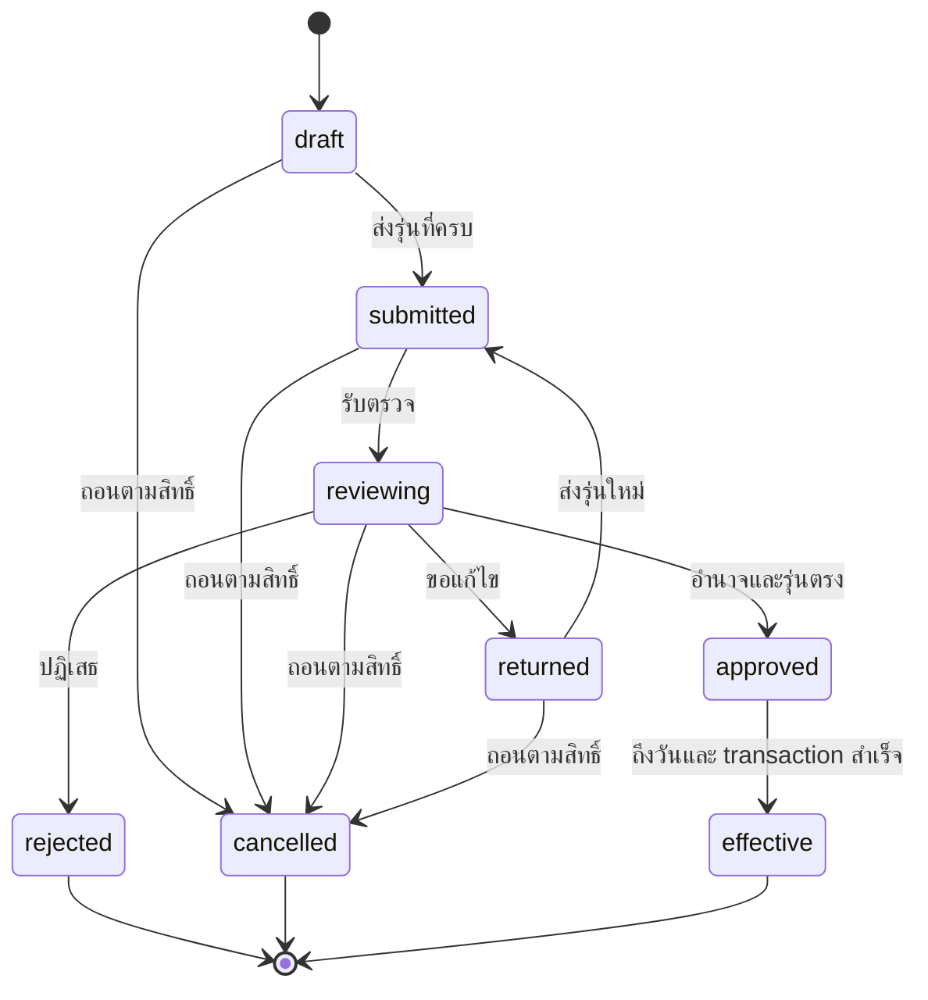

# คำขอจัดตั้ง ยุบ เปิด ปิด และย้าย — บท 30

รุ่น 0.1 | 4 ตุลาคม 2569 | source ก่อนแก้ `7c13070` | **Proposal / BLOCKED — ยังไม่มี schema หรือบริการคำขอระบบ 4 ที่ทำงานจริง**

บท 29 ยังไม่ผ่านตาม [UAT_SYSTEM_03](UAT_SYSTEM_03.md) และส่วนกลางยังขาด auth/session/DAL/files/workflow/outbox ตาม [FOUNDATION_ACCEPTANCE](FOUNDATION_ACCEPTANCE.md) `src/modules/requests` มี README เท่านั้น เอกสารนี้กับ [ORG_CENTER_REQUEST_SCHEMA](ORG_CENTER_REQUEST_SCHEMA.md) เป็นสัญญาเตรียมพัฒนา ไม่ใช่ migration, endpoint หรือแบบคำขอทางการที่รับรองแล้ว

## 1 แยกคำขอออกจากทะเบียนทีละขั้น

1. คำขอเก็บว่าใครเสนออะไร ใช้ข้อกำหนดรุ่นใด และขอมีผลวันไหน ยังไม่เปลี่ยน Organization, ExamCenter หรือ CenterSession ที่ใช้งานจริง
2. การส่งเรื่อง/ตรวจ/ส่งกลับ/อนุมัติเป็น workflow กลางของบท 11 ผู้สร้างคำขอหรือผู้สร้างรุ่นข้อเสนอที่กำลังตรวจไม่อนุมัติงานสำคัญของตน แม้มีหลายบทบาท และผู้มีสิทธิ์อ่านเหตุผลไม่จำเป็นต้องมีสิทธิ์อ่านหลักฐานทุกไฟล์
3. อนุมัติแล้วอาจยังรอวันมีผลหรือรอแก้ข้อขัดแย้ง ต้องแสดง “อนุมัติแล้ว — ยังไม่มีผล” แยกจากสถานะทะเบียนจริง ห้ามใช้ approved เป็นเปิดรับสมัคร
4. เมื่อถึงวันและผ่านการตรวจเงื่อนไขปัจจุบัน จึงบันทึก ActivationRecord + StatusEvent และเปลี่ยนทะเบียน/ประวัติผ่านบริการเจ้าของใน transaction เดียวกับ receipt/audit/outbox
5. ปฏิเสธหรือยกเลิกจบรอบคำขอ ไม่มีการเปลี่ยนสถานะทะเบียนหรือย้ายใบสมัคร ตำแหน่ง สิทธิ์ และที่อยู่ย้อนหลัง การแก้ผลที่มีจริงใช้เรื่องใหม่อ้างต้นทาง ไม่แก้ audit เดิม

ใช้ Organization/Person/ExamType/AcademicYear/PolicyVersion/Document/บัญชี และ workflow กลางเดิม ไม่สร้าง login ทะเบียนใบสมัคร หน้าติดต่อ หรือ engine อนุมัติอีกชุด วันที่เก็บ Gregorian/เวลามาตรฐาน แสดง พ.ศ.; effective_on ที่เป็นวันแปลงขอบวัน Asia/Bangkok ตามนโยบายที่ตรึง ไม่ใช้วันที่ UTC ของเครื่องแทนวันไทย

## 2 Coverage ประเภทคำขอ

รหัส DEMO ด้านล่างเป็นรหัสแผนภายใน ไม่ใช่รหัสหรือชื่อแบบทางการ ไม่มีแบบ/กฎ/คำสั่ง/ผู้มีอำนาจจากเจ้าของแนบมาสำหรับบทนี้ ทุกแถวต้องมี form template และ rule version ของตน พร้อม source/evidence/ผู้เสนอ/ผู้ตรวจ/ผู้อนุมัติ/effective date ก่อนใช้จริง ใช้ flow ทดลองที่ติด Proposal ต่อได้เมื่อ dependency พร้อม

| Case ref | เป้าหมาย       | การขอ   | ประเภทการสอบ  | Flow/แบบทดลองเสนอ                               | กฎและแบบทางการ | ผลรัน   |
| -------- | -------------- | ------- | ------------- | ----------------------------------------------- | -------------- | ------- |
| C30-01   | สำนักเรียน     | จัดตั้ง | ไม่เกี่ยวข้อง | DEMO_FORM_ORG_ESTABLISH_STUDY_BUREAU_V1         | TO VERIFY      | NOT RUN |
| C30-02   | สำนักเรียน     | ยุบ     | ไม่เกี่ยวข้อง | DEMO_FORM_ORG_DISSOLVE_STUDY_BUREAU_V1          | TO VERIFY      | NOT RUN |
| C30-03   | สำนักศาสนศึกษา | จัดตั้ง | ไม่เกี่ยวข้อง | DEMO_FORM_ORG_ESTABLISH_RELIGIOUS_STUDY_UNIT_V1 | TO VERIFY      | NOT RUN |
| C30-04   | สำนักศาสนศึกษา | ยุบ     | ไม่เกี่ยวข้อง | DEMO_FORM_ORG_DISSOLVE_RELIGIOUS_STUDY_UNIT_V1  | TO VERIFY      | NOT RUN |
| C30-05   | สนามสอบ        | เปิด    | นักธรรม       | DEMO_FORM_CENTER_OPEN_NAKTHAM_V1                | TO VERIFY      | NOT RUN |
| C30-06   | สนามสอบ        | ปิด     | นักธรรม       | DEMO_FORM_CENTER_CLOSE_NAKTHAM_V1               | TO VERIFY      | NOT RUN |
| C30-07   | สนามสอบ        | ย้าย    | นักธรรม       | DEMO_FORM_CENTER_MOVE_NAKTHAM_V1                | TO VERIFY      | NOT RUN |
| C30-08   | สนามสอบ        | เปิด    | ธรรมศึกษา     | DEMO_FORM_CENTER_OPEN_DHAMMASUKSA_V1            | TO VERIFY      | NOT RUN |
| C30-09   | สนามสอบ        | ปิด     | ธรรมศึกษา     | DEMO_FORM_CENTER_CLOSE_DHAMMASUKSA_V1           | TO VERIFY      | NOT RUN |
| C30-10   | สนามสอบ        | ย้าย    | ธรรมศึกษา     | DEMO_FORM_CENTER_MOVE_DHAMMASUKSA_V1            | TO VERIFY      | NOT RUN |

OrganizationType refs ต่อจาก [ORGANIZATION_TYPES](ORGANIZATION_TYPES.md) ไม่เดารหัสทางการจากชื่อ นักธรรม/ธรรมศึกษาอ้าง ExamType คนละ UUID และ ExamSession ที่ตรงประเภท/AcademicYear ผ่าน composite binding ตาม [EXAM_SESSIONS](EXAM_SESSIONS.md) ไม่ใช้ระดับตรี/โท/เอกหรือช่วงชั้นเป็นประเภทสอบ

Flow ทดลองสนามในบทนี้เสนอขอบเขต **ROUND**: เปิด/ปิด/ย้ายการใช้งานสนามใน ExamSession หนึ่งบน ExamCenter กลางเดิม ยังไม่ถือว่าปิดสนามแม่บททุกปี/ทั้งสองประเภท ย้าย Venue ของรอบไม่เปลี่ยนที่อยู่ Organization แม่บทหรือ snapshot ของเอกสารเก่า ขอบเขต MASTER/ทุกปี/ประเภทที่รับหลายรอบและการเปิดแม่บทใหม่ยัง Q002/Q004/Q024 TO VERIFY ต้องแยกกฎและ approval impact ก่อนทำ ไม่ตีความคำว่าเปิด/ปิดให้เปลี่ยนทุกอย่างพร้อมกัน

## 3 ข้อมูลฟอร์มและหลักฐานขั้นต่ำเสนอ

| ส่วน           | สิ่งที่ผู้ร้องเสนอ                                                              | สิ่งที่ server ต้อง resolve/ตรวจ                                                                                                               |
| -------------- | ------------------------------------------------------------------------------- | ---------------------------------------------------------------------------------------------------------------------------------------------- |
| หัวเรื่อง      | ประเภท/เป้าหมาย/เหตุผล/effective_on                                             | identity/session/current action/scope/assignment; request code ออกฝั่ง server                                                                  |
| จัดตั้งหน่วย   | ชนิดที่ขอ รหัส/ชื่อเสนอ host/สายสังกัด/สถานที่อ้างอิงที่มีหลักฐาน               | reuse identity หากเป็นหน่วยของทะเบียนเดิมตามกฎที่ยืนยัน; type/parent/cycle/namespace ห้าม duplicate Organization โดยเพียงชื่อคล้าย             |
| ยุบหน่วย       | Organization กลางเดิม วันที่ และแผนผลกระทบ                                      | actual type/current status/relations/หน้าที่/เอกสาร/งานค้าง; ไม่ delete หรือโยก FK เอง                                                         |
| สนามสอบ        | ExamCenter, ExamSession, ExamType, ขอบเขต ROUND; CenterSession ถ้ามี            | center/session/type/year context จาก DB; OPEN ที่ยังไม่มี CenterSession ต้องใช้ target binding ที่ schema กำหนด; CLOSE/MOVE ต้องมีเป้าหมายจริง |
| ย้ายสนาม       | OrganizationLocation/AddressVersion ปลายทางที่ตรวจแล้ว และ snapshot/source refs | owner/type/current verification/ช่วงใช้สถานที่/ACL; ไม่เดาที่อยู่หรือพิกัดจากชื่อ และไม่ rewrite dispatch/address snapshot เดิม                |
| หลักฐาน        | เอกสารตาม requirement type, version/hash/issuer/source                          | FileVersion ที่ scan ผ่าน/ชนิด/ขนาด/ACL/owner/resource binding; Document metadata อย่างเดียวไม่พอ                                              |
| ตรวจและอนุมัติ | ผู้มีหน้าที่ เหตุผลการตัดสิน/หลักฐานอำนาจ                                       | WorkflowDefinition/Instance/StepDecision รุ่นที่ pin, maker-checker และ current assignments ในแต่ละขั้น                                        |

ร่างอาจยังไม่ครบตาม draft policy; submit ต้องครบตาม form/rule schema ที่ validation ได้ ห้ามให้ client ส่ง SQL ชื่อ model หรือ policy ที่รันโค้ดได้ การแก้ payload/evidence/effective date หลังส่งต้อง new RequestVersion และรอบตรวจใหม่ ไม่ใช้คำอนุมัติ snapshot เก่าอนุมัติข้อเสนอใหม่

## 4 Flow ทดลองและ transition table

สถานะ canonical ใช้ [WORKFLOW_ENGINE](WORKFLOW_ENGINE.md) ชุดเดียว `draft/submitted/reviewing/returned/approved/rejected/cancelled/effective` ส่วน “รอวันมีผล/ถูกพักเพราะเงื่อนไขไม่พร้อม” เป็น activation condition ของ approved ไม่เพิ่ม status อีกชุดที่บอกทะเบียนผิด

| Transition ref | จาก → ไป/คำสั่ง                                        | เงื่อนไขฝั่ง server                                                                                                                                | ผลต่อทะเบียนจริง                                        |
| -------------- | ------------------------------------------------------ | -------------------------------------------------------------------------------------------------------------------------------------------------- | ------------------------------------------------------- |
| TR30-01        | draft → draft / บันทึกร่าง                             | current requester/edit grant, expected version, typed form, operation receipt                                                                      | ไม่มีผล; proposal เท่านั้น                              |
| TR30-02        | draft → submitted                                      | form/evidence/target/context/rules/source-window ผ่าน; seal version/hash; pin workflow/form/rule                                                   | ไม่มีผล; outbox เฉพาะเหตุการณ์คำขอ                      |
| TR30-03        | submitted → reviewing                                  | assigned reviewer มีสิทธิ์และไม่ใช่ผู้สร้าง; review snapshot ตรง                                                                                   | ไม่มีผล                                                 |
| TR30-04        | reviewing → returned                                   | decision/reason/evidence/current version ตามหน้าที่                                                                                                | ไม่มีผล; เก็บ decision รอบเดิม                          |
| TR30-05        | returned → returned / แก้ร่างรุ่นใหม่                  | requester/current edit scope; append RequestVersion ไม่แก้ sealed version                                                                          | ไม่มีผล                                                 |
| TR30-06        | returned → submitted                                   | seal รุ่นใหม่และ review cycle ใหม่; ตรวจครบ/ข้อขัดแย้งใหม่                                                                                         | ไม่มีผล; คำอนุมัติรอบเดิมใช้ไม่ได้                      |
| TR30-07        | reviewing → approved                                   | ผู้อนุมัติครบตามกฎที่ pin, maker-checker, expected versions, authority/evidence และ planned-target conflict guard                                  | ไม่มีผล; approved ยังไม่ active                         |
| TR30-08        | reviewing → rejected                                   | อำนาจปฏิเสธ/reason/currentversion/receiptครบ                                                                                                       | ไม่มีผลต่อทะเบียน; release intent claim ตาม transaction |
| TR30-09        | draft/submitted/reviewing/returned → cancelled         | อำนาจถอนเรื่องตาม policy, versions/receipt; ไม่ใช่สิทธิ์อัตโนมัติของทุก actor                                                                      | ไม่มีผลต่อทะเบียน; ไม่ลบคำขอ/ประวัติ                    |
| TR30-10        | approved → approved / รอหรือพัก activation             | วันยังไม่ถึง หรือกฎ/หลักฐาน/grant/ผลกระทบ/target version เปลี่ยน                                                                                   | ไม่มีผล; เหตุผลปลอดภัยแสดงแยกจากทะเบียน                 |
| TR30-11        | approved → effective                                   | วันถึง; current authority, exact sealed approved version, conflict/impact/target/ACL ผ่าน; atomic owner effect + activation receipt + audit/outbox | มีผลครั้งเดียวตาม domain rule ที่รับรอง                 |
| TR30-12        | rejected/cancelled/effective → ปฏิเสธการแก้ status ตรง | จบรอบ; เรื่องแก้ผลต้องใหม่ที่อ้างต้นทางและ approval ใหม่                                                                                           | ไม่มีการกลับทะเบียนด้วย direct status edit              |

ไม่เสนอ approved→cancelled ตรงในบทนี้ การเพิกถอนคำอนุมัติก่อนมีผลหรือการแก้ผลหลังมีผลต้องกฎ/อำนาจที่ยืนยัน และคำขอแก้ไขเชื่อมต้นทาง ไม่แอบลบ approval/event เพื่อกลับไปร่าง ขอบเขตคำขอแก้ผลขั้นต่อไปต้องรอพรอมป์ต์และ dependency

## 5 รหัสและคำขอชนกัน

server ตรวจรหัสกลางและ namespace ที่ยืนยัน ไม่ใช้ unique ชื่อองค์กรแทน identity รหัสคำขอ unique/receipt ป้องกัน retry ส่วนการจัดตั้งต้องตรวจรหัส Organization ทั้งตอนส่ง/อนุมัติ/activation หากยังไม่มี target จริง ใช้ proposal ที่ผูก RequestVersion ไม่สร้าง Organization active เพื่อจองรหัสตั้งแต่ร่าง

คำขอชนกันพิจารณา canonical target + status dimension + scope + effective time และ incompatibility rules ที่มีรุ่น เช่น ROUND ของ center/session เดียวกันหรือ organization identity ที่จะจัดตั้ง ไม่ถือสนามเดียวทุกประเภท/ทุกปีขัดกันทั้งหมด ไม่ใช้ enum ประเภทเรื่องเป็น lock key เดียวจน OPEN กับ CLOSE หลุดการแข่งขัน

ใน transaction lock target/identity guard key ตามลำดับที่บริการกลางใช้ ตรวจ row version/approved plan revision และจำลอง effective timeline ที่เกี่ยวข้องก่อนอนุมัติและก่อนมีผล Requests วันเดียวกันที่ผลขัดกันต้อง conflict; ช่วงเวลาข้ามกันใช้ rule ตรวจ intersection ที่นิยามจริง การเปิดวันนี้และปิดวันหน้าอาจเป็นลำดับที่ถูกต้อง ไม่ใช้ช่วง `[effective_on, infinity)` ของทุกคำขอเป็น blanket exclusion จนปฏิเสธทุกเรื่องถัดไป

กรณีต่างวันแต่ต้องพึ่งคำขอก่อนหน้า ให้เก็บ expected state/dependency/version ใน approved plan ถ้าต้นทางถูกยกเลิกหรือยังไม่มีผลต้อง hold/review ใหม่ ห้าม activation จาก cached proposal รหัสใหม่ที่ชนจาก writers สองคนต้องใช้ DB unique และ atomic identity guard เมื่อ implementation พร้อม ไม่ใช้ CHECK ข้ามแถวหรือ “ตรวจไม่พบแล้ว INSERT” อย่างเดียว

ช่วง claim/reservation ของแผนเป็นข้อมูลการจัดคิว private ไม่ใช่สถานะทะเบียน/สิทธิ์ การถอน claim ไม่คืนสิทธิ์หรือเปิดรับสมัคร กฎ incompatible/reopen/ย้ายข้ามพื้นที่/หลายรอบยัง TO VERIFY; ถ้าประเมินไม่ได้ให้ NOT_READY/hold ไม่อ้างว่าไม่มีข้อมูลคือไม่มีผลกระทบ

## 6 Failure modes และการกู้คืน

| Failure ref | จุดขัดข้อง                                                     | สิ่งที่ต้องรักษา                                              | วิธีดำเนินต่อเสนอ                                                                                |
| ----------- | -------------------------------------------------------------- | ------------------------------------------------------------- | ------------------------------------------------------------------------------------------------ |
| F30-01      | form/source/authority ยังไม่รับรอง                             | Proposal/TO VERIFY ไม่มีคำสั่งหรือผลทางการ                    | รอเจ้าของยืนยัน policy/form version; ทดลองเฉพาะ config DEMO ที่อนุญาต                            |
| F30-02      | evidence scan pending/ถอน ACL/รุ่นไฟล์เปลี่ยน                  | ไม่ submit/approve/activate รุ่นที่ไม่ผ่าน                    | แนบ FileVersion ที่ตรวจแล้ว สร้างรุ่นคำขอใหม่/reviewตามผลกระทบ ไม่เปลี่ยน hash ใต้ approval เดิม |
| F30-03      | แก้คำขอ/target ระหว่างตรวจ หรือ approve แข่ง                   | ไม่มี mixed-version decision/effect                           | conflict อ่านรุ่นที่มีสิทธิ์ใหม่ ตรวจ/อนุมัติใหม่ ไม่บังคับทับด้วย revision client               |
| F30-04      | รหัสจัดตั้งหรือผล planned timeline ชน                          | ไม่มีทะเบียนซ้ำหรือเหตุการณ์ขัดกัน                            | พักเรื่อง ตรวจ identity/หลักฐาน ให้ผู้มีหน้าที่แก้แผน ไม่ merge/delete เอง                       |
| F30-05      | พบใบสมัคร/ที่นั่ง/appointments/หนังสือ/งานค้างหรือ adapter ขาด | ไม่ใช้ count 0 แทน unknown; approval ยังไม่ effective         | impact assessment และ resolution ที่เจ้าของแต่ละระบบรับรอง ไม่โยกผู้สมัคร/คนรับข้อสอบอัตโนมัติ   |
| F30-06      | revoke/suspend/assignment หมดก่อน worker                       | ไม่ใช้ grant จากเวลาส่งเรื่องหรือ service credential แทนอำนาจ | hold พร้อม reasoncode; retryเมื่อมี current authority ที่รับรองและ exact decision scope          |
| F30-07      | ล่มก่อน transaction commit หรือ effect บางส่วนผิด              | rollback domain/activation/receipt/audit/outbox ทั้งหมด       | retry key/payload เดิม ตรวจ current conditionsใหม่ ไม่มีครึ่งสถานะ                               |
| F30-08      | commit สำเร็จแต่ ACKหาย/worker retry/leaseเก่า                 | canonical receipt/effect เดิม ไม่ปิด/ย้าย/สร้างซ้ำ            | unique activation + receipt + lease guard; คืนผลเดิมหลัง current read grant                      |
| F30-09      | แจ้งเตือนล้มเหลวหรือ dead letter                               | domain effect ที่ commit แล้วไม่ย้อนเพราะส่งแจ้งเตือนไม่ได้   | durable outbox/retry/dedupe/authorized replayตาม11 devsinkเท่านั้น                               |
| F30-10      | อนุมัติแล้วไม่ถึงวัน/สิ่งที่มีผลต่างจากแผน                     | แยก approved กับ effective และ recorded_at                    | workerตรวจ serverclock/AsiaBangkok cutoff/target invariants; holdหรือnewapprovalตามpolicy        |
| F30-11      | rejected/cancelled event เก่าถูก replay เป็น activation        | ไม่มี status event/registry change จากเรื่องจบรอบ             | check live request/decision/versionและreceiptใน transaction; denyและauditขั้นต่ำ                 |
| F30-12      | ต้องแก้ผลที่มีจริงหรือหลักฐานประวัติผิด                        | หลักฐานต้นทาง/เอกสารเก่า/auditยังอยู่                         | เรื่องแก้ไขใหม่พร้อมเหตุผล/หลักฐาน/approval ไม่ลบหรือrewindประวัติเดิม                           |

## 7 แผนตรวจรับ — ทุกกรณี NOT RUN

| Test ref | ขั้นทำซ้ำเมื่อ dependency พร้อม                                                        | สิ่งที่ต้อง assert                                                                                                    |
| -------- | -------------------------------------------------------------------------------------- | --------------------------------------------------------------------------------------------------------------------- |
| P30-01   | ทั้ง C30-01–10 ส่งร่าง/ส่ง/ตรวจ/อนุมัติ/ถึงวัน โดยใช้ type/sessionจริง                 | coverage/typedFK/rulesตรง แยกนักธรรม/ธรรมศึกษา; active registryเกิดเฉพาะeffective transaction                         |
| P30-02   | จัดตั้งถูกปฏิเสธ/ยกเลิก เปิด/ปิด/ย้ายทั้งสองประเภทถูกปฏิเสธ/ยกเลิก พร้อม replayเก่า    | registry/status/history/address/application/role/effectmanifestก่อนหลังไม่เปลี่ยน; ไม่มีactivation/eventที่ใช้จริง    |
| P30-03   | direct API/Action/job/RPC/clientstatus เพื่อบังคับ effectก่อนapprove/ก่อนวัน           | current DAL/RLS/limitedwrite/activation guarddenyทุกช่อง ไม่ใช้root403แทนallowed flow                                 |
| P30-04   | targetOrg/type/session/type/year/location/fileversion FKผิดหรือข้ามscope               | FK/context/owner/fieldACLdeny read/mutate/export/print/download/job; trackingไม่เผยreason/evidenceหรือexistence       |
| P30-05   | makerมีroleapprover, กฎ/target/evidenceเปลี่ยนระหว่างreview, returnedรุ่นใหม่          | makerchecker/conflict/version/reviewcycleบังคับ ไม่ใช้decisionเก่าอนุมัติใหม่                                         |
| P30-06   | รหัสเดิม/ชื่อคล้าย/parallelจัดตั้งต่างkeys                                             | verifiedidentityตรวจโดยเจ้าหน้าที่ ไม่auto merge; DBunique/guardreceiptกันduplicateactiveOrg                          |
| P30-07   | OPEN+CLOSEหรือMOVEคนละปลายทางวันเดียว, ช่วงทับ, เปิดวันนี้ปิดวันหน้า, ต่างsession/type | incompatibleplanconflictตามpolicy; compatibletimelineอนุญาต; ไม่blanketlockทุกประเภท/ปี; dependencyก่อนหน้าหายให้hold |
| P30-08   | scanpending/ปลอมชนิด/oversize/ACLwithdraw/sourcewindowหมด                              | submit/approve/effectiveไม่ใช้metadataแทนscan; proposal/evidencepinถูกไม่มีprivatepublicassets                        |
| P30-09   | close/move/dissolveมีapplication/seat/appointment/docsงานค้างหรือadaptermissing        | impactNOT_READYไม่0; ไม่delete/ย้ายคนหรือใบสมัครเอง; approvedไม่effective                                             |
| P30-10   | revoke/หมดassignmentระหว่างready→activation/worker และเที่ยงคืนไทย                     | currentauthority/lease/servercutoffตรวจจริง; อนาคตยังไม่active; effective_onไม่เลื่อนจากUTCdate                       |
| P30-11   | ล่มก่อน/หลังcommitก่อนACK retryเปลี่ยนkey/payload/workerlease                          | receipt/activation/effect/audit/outboxatomicและไม่ซ้ำ; staleworkerเขียนไม่ได้; notificationdedupe                     |
| P30-12   | ย้ายVenueรอบหนึ่ง/ปิดประเภทหนึ่ง แล้วอ่านรอบ/ปี/typeอื่นและdispatchเก่า                | centralidentityเดิมอยู่ snapshot/history/address/filehashเดิมไม่rewrite อีกtype/ปีไม่ปิดตามโดยไม่ได้อนุมัติ           |
| P30-13   | terminalstatusถูกแก้กลับร่าง/approvedcancelตรง/newcorrectionไม่มีapproval              | denyตรง; เรื่องใหม่มีsource evidence/currentapproval ไม่ลบauditหรือคืนscopeอัตโนมัติ                                  |
| P30-14   | publictracking/search/HTML/RSC/cache/export/error/notifและผู้เสนอ/ผู้ตรวจต่างscope     | safeDTOตามpolicy/proofไม่มีreason/files/personprivatedetails; unknownofficialruleและDEMO labelsชัด                    |

หลักฐานแต่ละ execution ต้องมี source/migration/fixture/policy/form/actor/scope/serverclock/requestversion/decision refs, actual assertion, before-after private registry manifest, fault point และ receipt/effectcounts ไม่ commit password/token/เนื้อหาเอกสาร/เหตุผลเต็มชุด ไม่มี executable tests/entrypointระบบ4ใน package ตอนนี้

## 8 Gate, versions และสิ่งที่ยังค้าง

ครบประเภทใน coverage/contract 10 กรณีเป็น **แผนเอกสาร** ไม่ใช่ระบบที่ใช้งานได้ เกณฑ์แยกนักธรรม/ธรรมศึกษาและปฏิเสธ/ยกเลิกไม่เปลี่ยนทะเบียน **BLOCKED / NOT RUN** ต้องมี FK/services/worker/limitedDB grants และ native concurrency/effect testsจริงก่อนรับรอง

app/schema `0.6.0`, Prisma `7.10.0`, Next `16.3.8`, pnpm `11.28.2`, lockfile `9`; physical core 19 models / 213 scalar fields / migration 1 ไม่เปลี่ยน ไม่มี OrganizationChangeRequest/ExamCenterChangeRequest models หรือ migration/seed/runtime30 Migration เดิม `20261003130000_core_foundation` SHA256 `04a149fcd349f0ac3f1b5929cfcf571f8b0880541e84a40ad929054b67d72756`

Q001/Q003/Q005/Q006/Q024 ต้องชื่อ/รุ่นแบบ แหล่ง/อำนาจ สายตรวจ/source/evidence/target scope/code/identity/incompatibility/activationและแก้ผล Q002/Q004/Q017 ต้องหน่วยเดิม/ประเภท/session/year/ROUNDหรือMASTER/วันไทย Q008/Q025/Q016 ต้องvisibility/claim/retention Q011/Q023 ต้องDAL/RLS/scan/workflow/atomicowner effects/workerจริง บท29และDB-06/Q027/DOCKER-05/Q026ยังเปิดตามหลักฐาน29 ไม่รัน environment probeใหม่ใน30

ต้องปิด29และdependencyส่วนกลาง/หน่วยงาน19–22 ก่อนimplementation30 แล้วรัน P30-01–14 ไม่มีproduction/ข้อมูลจริงเปลี่ยน ไม่เลื่อนไป31จากschema contractหรือdiagram ไม่สร้างmoduleสถานะ/แก้ผล/impactconsumerล่วงหน้าที่อ้างใช้งานได้

## 9 คำสั่งและผลตรวจเอกสารจริงในบท30

| วิธี/คำสั่ง                                                                                                                                                | ผลจริง                                                                                                                                                   | ขอบเขต                                                                                            |
| ---------------------------------------------------------------------------------------------------------------------------------------------------------- | -------------------------------------------------------------------------------------------------------------------------------------------------------- | ------------------------------------------------------------------------------------------------- |
| git status/log และอ่านไฟล์ schema/package/lock/migration/module                                                                                            | source7c13070 clean main ahead19 ก่อนแก้ requestsREADME-only; Auth/Authz/Workflow directoriesไม่มี; core19models/213scalarfields/migration1/checksumเดิม | พิสูจน์dependencyขาด ไม่ใช่activationหรือauthorizationผ่าน                                        |
| Python inlineตรวจตาราง coverage/formrefs/concepts/constraints/transitions/failures/caseIDs/diagram/local links/inventory                                   | PASS: coverage10ไม่ซ้ำตรง4องค์กร+6สนาม / formrefs10 / typedconcepts6 / constraints8 / transition12 / failure12 / plan14 / local links17 / states8        | ตรวจโครงสร้างเอกสารเท่านั้น เส้นdiagramจากapprovedไปeffectiveไม่พิสูจน์serverguard                |
| `corepack pnpm exec prettier --ignore-path /dev/null --check docs/ORG_CENTER_REQUESTS.md docs/ORG_CENTER_REQUEST_SCHEMA.md src/modules/requests/README.md` | PASS                                                                                                                                                     | เฉพาะMarkdown3ไฟล์นี้                                                                             |
| `git diff --check` และ `git diff --cached --check`                                                                                                         | PASS working/staged7ไฟล์                                                                                                                                 | whitespacecheck ไม่ใช่effect tests                                                                |
| `corepack pnpm secrets:check` หลังstage                                                                                                                    | PASS                                                                                                                                                     | เฉพาะแพตเทิร์นที่scriptรองรับ/ไฟล์ที่Gitเห็น ไม่รับรองsecretทุกชนิด                               |
| unit/lint/typecheck/build/nativeDB/SQLWASM/API/browser/worker/C30/P30/environmentprobeใหม่                                                                 | NOT RUN                                                                                                                                                  | ไม่มีruntimeเปลี่ยนและdependency29/ส่วนกลาง/ทะเบียนยังขาด ไม่ใช้rootunit17จาก29แทนnoeffect/FKผ่าน |

ชื่อcommitรอบนี้ “บทที่ 30: เตรียมคำขอหน่วยงานและสนามสอบที่ยังติด dependency” ไม่push/deploy ทุกP30ยังNOT RUN ต้องตรวจnativebefore-afterregistrymanifest/limitedwrite/activationreplayจริงก่อนรับรอง ไม่เลื่อนไป31
