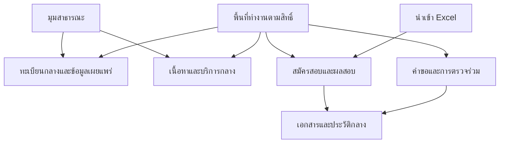

# ผังเว็บไซต์ — เว็บไซต์กองบริหารทะเบียนและวัดผล

บท 03 | รุ่นเอกสาร 1.3 | 3 ตุลาคม 2569 (2026-10-03)

## 1 วิธีอ่านและขอบเขต

Sitemap คือบัญชีว่ามีหน้าอะไร อยู่ตรงไหน และผู้ใช้เดินไปหาหน้านั้นอย่างไร บทนี้ออกแบบหน้าและเส้นทาง ไม่สร้าง Next.js, ฐานข้อมูล, RLS หรือบริการจริง ฐานบท 02 คือ commit `134cf16` และ [ข้อกำหนด](REQUIREMENTS.md), [สิทธิ์](PERMISSIONS.md), [การเชื่อมข้อกำหนด](TRACEABILITY.md)

ชื่อเมนู จำนวนเมนู บริการร่วม เขต `/app/...` และ `/app/admin` เป็น **Confirmed** ตามผู้ใช้ เส้นทางย่อย หน้าใหม่ การจัดวางและข้อความตัวอย่างเป็น **Proposal** บันทึก DEC-023–DEC-028 และ Q021–Q022 ข้อเสนอไม่ได้ยืนยันอำนาจ แบบฟอร์มหรือระเบียบทางการ ข้อมูลในแบบร่างสมมติทั้งหมด

มี 9 ระบบธุรกิจ แต่พื้นที่ทำงานมีแดชบอร์ด 1 เมนูและเมนูงาน 8 เมนู ระบบ 09 อยู่ในระบบ 05 เป็นช่องทาง Excel ไม่เพิ่มเมนูหลักหรือทะเบียนใบสมัคร บัญชี Person Organization Application เอกสาร ตารางแสดงข้อมูล ฟอร์มหลายขั้น และขั้นตอนอนุมัติใช้ส่วนกลางร่วมกัน

## 2 เมนูสาธารณะ 7 เมนู

| ลำดับ | ชื่อเมนูที่แสดง | เส้นทางต้นทาง | หน้าย่อยและหน้าที่ | สิทธิ์ |
| --- | --- | --- | --- | --- |
| 1 | หน้าแรก | `/` | ข่าวจาก `/news`, ทางลัดทะเบียน สอบ คลังข้อสอบ และงานของฉันเมื่อเข้าสู่ระบบ | P09; ทางลัดภายในตรวจ session เพิ่ม |
| 2 | ทะเบียน | `/registry` | บุคคล `/registry/people`, หน่วยงาน `/registry/organizations`; อ่าน public projection จากทะเบียนกลาง | P09 ตามนโยบาย Q008 |
| 3 | สอบธรรมสนามหลวง | `/exams` | ข้อมูลสอบที่เผยแพร่, ค้นผลรายปี `/exams/results` | P09 เฉพาะรุ่นเผยแพร่ |
| 4 | ติดตามคำขอ | `/requests/track` | ตรวจสิทธิ์ติดตามก่อนคืนสถานะ; ไม่เปิดเอกสารด้วยเลขคำขออย่างเดียว | หลักฐานสิทธิ์ตาม Q019; default deny สำหรับรายละเอียด |
| 5 | คลังข้อสอบ | `/learn` | หลักสูตร 9 กลุ่ม `/learn/courses`, รายละเอียดหลักสูตรและบทเรียนที่เผยแพร่ | P09; เริ่มบันทึกความก้าวหน้าต้องเข้าระบบ |
| 6 | ดาวน์โหลด | `/downloads` | ไฟล์ public ที่ผ่านตรวจและเผยแพร่; เทมเพลต private แสดงหลังตรวจ P07 ไม่เป็นคลังใหม่ | P09 สำหรับ public; P07+ACL สำหรับ private |
| 7 | ติดต่อเรา | `/contact` | ข้อมูลติดต่อหน่วยงานส่วนกลางเพียงชุดเดียว อ้างองค์กรกลาง | P09 เฉพาะข้อมูลกลางที่รับรอง |

ข่าว คู่มือ FAQ และนโยบายอยู่ในทางลัดหัวเว็บ/ท้ายเว็บ ไม่เพิ่มเมนูหลักเป็น 8 หรือ 9 เมนู หัวเว็บเป็นชิ้นส่วนเดียวเปลี่ยนบริบทสาธารณะ/พื้นที่ทำงาน ไม่คัดลอกต่อระบบ

## 3 เมนูพื้นที่ทำงาน 9 เมนูและ 3 กลุ่ม

| ลำดับ | กลุ่มแถบข้าง | เมนู | ต้นทาง | งานย่อย | ระบบ/REQ |
| --- | --- | --- | --- | --- | --- |
| 1 | ก่อนกลุ่มงาน | แดชบอร์ด | `/app` | งานค้างของฉัน, งานที่ส่งกลับ, งานรออนุมัติ, งานเบื้องหลัง, การเรียนของฉัน | ส่วนกลาง; REQ-C03 |
| 2 | บุคคลและทะเบียน | บุคลากร | `/app/people` | ของฉัน, ค้นในพื้นที่, ประวัติ, เสนอแก้ผ่านคำขอกลาง | 01; REQ-S01 |
| 3 | บุคคลและทะเบียน | ทะเบียนสถานที่ | `/app/organizations` | หน่วยงาน, ที่ตั้ง, สนามสอบรายปี, ผู้รับข้อสอบจาก Person | 02; REQ-S02 |
| 4 | การสอบและการเรียน | สมัครสอบและผลสอบ | `/app/exams` | ผู้เรียน, ใบสมัคร, ตรวจ/ที่นั่ง, คะแนน/ผล, นำเข้า Excel | 05+09; REQ-S05, REQ-S09 |
| 5 | บุคคลและทะเบียน | คำขอ | `/app/requests` | ร่าง/ส่งตรวจ/ส่งกลับ/อนุมัติ/รอมีผล; เชื่อมเรื่องบุคคลและหน่วยงาน | 04 และเรื่อง 01; REQ-S04, REQ-S01 |
| 6 | การสอบและการเรียน | คลังข้อสอบ | `/app/learning` | หลักสูตร, ก่อนเรียน/บทเรียน/หลังเรียน, ความก้าวหน้า, จัดทำเนื้อหาตามสิทธิ์ | 03; REQ-S03 |
| 7 | งานสำนักงาน | สารบรรณ | `/app/office` | รับ/ส่ง/เวียน, หนังสือของฉัน, รับทราบ/มอบหมาย, เอกสารตาม ACL | 08; REQ-S08 |
| 8 | งานสำนักงาน | งบประมาณ | `/app/budget` | ปีงบ, แหล่งเงิน, จอง/ผูกพัน/จ่าย, รายงาน | 06; REQ-S06 |
| 9 | งานสำนักงาน | พัสดุ-ครุภัณฑ์ | `/app/inventory` | วัสดุ, ขอซื้อ/ตรวจรับ, ครุภัณฑ์, ผู้ถือครอง/ยืมคืน/ตรวจนับ | 07; REQ-S07 |

ลำดับภายในแถบข้างใช้ แดชบอร์ด → บุคคลและทะเบียน (บุคลากร, ทะเบียนสถานที่, คำขอ) → การสอบและการเรียน (สมัครสอบและผลสอบ, คลังข้อสอบ) → งานสำนักงาน (สารบรรณ, งบประมาณ, พัสดุ-ครุภัณฑ์) ไม่ใช้ลำดับแถว 4/5 สลับกลุ่ม

`/app/admin` เป็นเมนูเสริมเฉพาะผู้ดูแลที่มี P08/P10/P11 ตามงานที่มอบหมาย ไม่เป็นเมนูหลักลำดับ 10 และไม่ให้ P05/P06 ทางธุรกิจเอง แสดงเฉพาะหน้าจัดการที่มี grant จริง

## 4 หน้าบริการกลางหนึ่งต้นทาง

| บริการ | หน้า/ต้นทางเสนอ | แหล่งข้อมูลร่วม/ผู้ดูแลเสนอ | ทางเข้าจากทุกระบบ |
| --- | --- | --- | --- |
| หัวเว็บ/ท้ายเว็บ | ชิ้นส่วน `SiteHeader` / `SiteFooter` | site_content + organization กลาง; C04 | เปลี่ยนบริบทเมนูโดยใช้ชิ้นส่วนเดียว |
| ข่าว | `/news`, `/news/{news_id}` | news_post และรุ่นเผยแพร่; C04 | หน้าแรกและทางลัดเข้าแหล่งเดิม |
| คู่มือ | `/help`, `/help/{guide_id}` | site_content ชนิดคู่มือ; C04 + เจ้าของงาน | `guide_id` กรองคู่มือของระบบ ไม่สร้าง `/app/budget/help` อีกชุด |
| ดาวน์โหลด | `/downloads` | download_entry + document/file_version กลาง; C04 | ตัวกรองประเภท/ปี/รุ่น; private ต้องตรวจสิทธิ์ก่อนคืนรายการและไฟล์ |
| คำถามที่พบบ่อย | `/faq` | site_content ชนิด FAQ; C04 | ลิงก์กลางพร้อมตัวกรองหัวข้อ |
| ติดต่อเรา | `/contact` | เนื้อหาเดียวอ้าง organization กลาง; C04 + O02 | ไม่มี `/app/*/contact` |
| ข้อมูลหน่วยงานส่วนกลาง | `/about` | site_content อ้าง organization เดิม; C04 + O02 | รายละเอียดองค์กรกลางเป็น public projection ไม่สร้างทะเบียนใหม่ |
| นโยบาย | `/policies`, `/policies/{policy_id}` | site_content รุ่นนโยบายที่รับรอง; C03 + C04 | ไม่แต่งเนื้อหากฎหมายหรือ consent ที่ยังไม่ยืนยัน |
| เข้าสู่ระบบ/กู้บัญชี | `/login` | Supabase Auth บัญชีเดียว; C02 | กู้บัญชีเป็นสถานะ/ขั้นย่อยของต้นทาง login ไม่สร้าง login รายระบบ |
| แจ้งเตือน | `/app/notifications` | บริการแจ้งเตือนกลาง; C02 | ป้ายจำนวนจากข้อมูลที่มีสิทธิ์ กดแล้วตรวจต้นเรื่องใหม่ |

หน้า public กับหน้าเจ้าหน้าที่เป็น **สองมุมมองของทะเบียนเดียว** ไม่เป็นฐานข้อมูลซ้ำ มุมสาธารณะไม่คืนเลขประชาชน วันเกิด ที่อยู่ส่วนตัว เบอร์ส่วนตัว และหลักฐานส่วนตัว รวม HTML/API/ค้นหา/export/print/cache ชื่อ/สังกัด/ตำแหน่งในแบบร่างยังเป็นตัวอย่างรอ Q008 ไม่ใช่ชุดฟิลด์ที่อนุมัติเผยแพร่จริง

เอกสารและคำขอเป็นข้อมูลร่วม: person_change_request และ change_request ที่บท 02 เสนอเป็นชนิดเรื่องต่างกัน ใช้ฟอร์ม/Workflow/บริการหลักฐานกลางตามชนิด ไม่เสนอ migration รวมตารางในบทนี้ `/app/people/requests` เป็นทางลัดไป `/app/requests?subject=person` พร้อมบริบท ไม่สร้างคิวอนุมัติหรือฟอร์มแยก

## 5 บัญชีหน้าและข้อจำกัดการเข้าถึง

ทุกแถวใช้ชุดสถานะ S-L/S-E/S-X/S-403/S-404 จาก WIREFRAMES; หน้าค้นเพิ่มสถานะยังไม่ค้น S-I แบบร่างไม่ใช่หลักฐาน backend ผ่านสิทธิ์ หน้ารายละเอียดตัวตน/เอกสารนอก scope ใช้ 404 ไม่เปิดเผยการมีอยู่ ส่วนหน้างานที่ทราบอยู่แล้วแต่ขาด action ใช้ 403 ตาม contract บท 02

| รหัสหน้า | เส้นทาง/รูปแบบเสนอ | ผู้ใช้/สิทธิ์ขั้นต่ำแบบมีเงื่อนไข | ผลปลายทาง/ความเชื่อมโยง | แบบร่าง |
| --- | --- | --- | --- | --- |
| PG-01 | `/` | public P09 | เลือกงาน ข่าว/ทางลัดกลาง | WF-01 |
| PG-02 | `/registry`, `/registry/people` | public P09 | ค้นเฉพาะทะเบียนเผยแพร่ | WF-02 |
| PG-03 | `/registry/people/{person_id}` | P09 projection; นอกนโยบาย404 | รายละเอียด public อ้าง person เดิม | WF-02 แผงรายละเอียด |
| PG-04 | `/registry/organizations`, `/registry/organizations/{organization_id}` | P09 projection | ค้น/ดูหน่วยงานกลาง | WF-03 |
| PG-05 | `/exams` | P09 | ข่าวสอบและค้นผล | WF-06 ทางเข้ากลาง |
| PG-06 | `/exams/results` | P09 เฉพาะ result_release ที่เผยแพร่ | ค้นปี/ประเภท/ระดับ ไม่ปะปนคะแนนฝึก | WF-06 |
| PG-07 | `/requests/track` | public shell; พิสูจน์สิทธิ์ Q019 ก่อนสถานะ | ติดตามขั้นต่ำหรือปฏิเสธแบบไม่เปิดเผย | WF-13 |
| PG-08 | `/learn`, `/learn/courses` | P09 เนื้อหาเผยแพร่ | เลือก 9 กลุ่มและหลักสูตร | WF-04 |
| PG-09 | `/learn/courses/{curriculum_id}` | P09 เฉพาะเผยแพร่ | รายละเอียด/บทเรียนเปิด; ไป login เพื่อเก็บความก้าวหน้า | WF-04 แผงหลักสูตร |
| PG-10 | `/news`, `/news/{news_id}` | P09 เนื้อหาเผยแพร่ | ข่าวต้นทางเดียว | WF-01 ชิ้นส่วนข่าว |
| PG-11 | `/downloads` | P09 public หรือ P07+ACL private | รับไฟล์รุ่นที่มีสิทธิ์และผ่านตรวจ | ชิ้นส่วนไฟล์ร่วม |
| PG-12 | `/contact` | P09 | ข้อมูลติดต่อกลาง | ชิ้นส่วนเนื้อหากลาง |
| PG-13 | `/help`, `/help/{guide_id}`, `/faq` | P09 public; คู่มือภายในตรวจ grant | คู่มือ/FAQ ชุดเดียว | ชิ้นส่วนเนื้อหากลาง |
| PG-14 | `/about`, `/policies`, `/policies/{policy_id}` | P09 รุ่นรับรอง | องค์กร/นโยบายกลาง | ชิ้นส่วนเนื้อหากลาง |
| PG-15 | `/login` | public shell; Auth กลาง | session แล้วกลับเส้นทางที่ได้รับอนุญาต | WF-12 |
| PG-16 | `/app` | valid session | งานค้างของตนที่มีสิทธิ์; ไม่มี grant ให้แสดงว่าง | WF-11 |
| PG-17 | `/app/people`, `/app/people/{person_id}`, `/app/people/me` | P01 ตน หรือ P02 ทะเบียนตาม grant | ข้อมูลและประวัติ; P03/P04 เสนอแก้ | WF-02 มุมภายใน |
| PG-18 | `/app/people/requests` | session+grantตามเรื่อง | ทางลัดคำขอกลางเท่านั้น | WF-05 |
| PG-19 | `/app/organizations`, `/app/organizations/{organization_id}` | P02 ทะเบียน; P03 แก้ตาม grant | ข้อมูล/ประวัติเดียวกับ public แต่ field visibility ต่าง | WF-03 มุมภายใน |
| PG-20 | `/app/organizations/exam-centers` | P02/P03 ตามสนาม+รอบ | สนามแม่บทแยกการเปิดรายรอบ | WF-03 ตัวกรองรอบ |
| PG-21 | `/app/requests`, `/app/requests/new` | P01/P02 ตามเรื่อง; P03 ร่าง | ร่าง/คิวที่มีสิทธิ์ | WF-05 |
| PG-22 | `/app/requests/{request_id}` | ownershipหรือP02+ประเภทเรื่อง+scope | P04ส่ง/P05ตัดสิน; วันมีผลแยกวันบันทึก | WF-05 + WF-11 คิว |
| PG-23 | `/app/exams` | session+grantงานสอบ | ทางเลือกผู้เรียน สมัคร ผล Excel | WF-06/WF-10 |
| PG-24 | `/app/exams/enrollments` | P01 ตน หรือ P02/P03 ตามหน่วย | enrollment อ้าง Person เดิม | ฟอร์มร่วม WF-05 |
| PG-25 | `/app/exams/applications`, `/app/exams/applications/{application_id}` | P01/P02/P03/P04/P05 แยกตาม action | application เดียวกับ Excel; ส่งแล้วรออนุมัติ | WF-05 โหมดใบสมัคร |
| PG-26 | `/app/exams/results` | P02คะแนน/รอบ; P03/P04คะแนน; P05รับรอง; P06เผยแพร่แยก | draft→รับรอง→release; publicอ่านเฉพาะrelease | WF-06 โหมดภายใน |
| PG-27 | `/app/exams/imports`, `/app/exams/imports/{batch_id}` | P03/P04 หน่วย/รอบ; P07เทมเพลต/รายงานแยก | dry run→commit receipt→ใบสมัครระบบ05 | WF-10 |
| PG-28 | `/app/learning` | P01 ตน หรือ grantหลักสูตร | เลือกเรียนต่อ/จัดทำเนื้อหาตามสิทธิ์ | WF-04 |
| PG-29 | `/app/learning/courses/{curriculum_id}` | enrollmentตน+published version | ก่อนเรียน→บทเรียน→หลังเรียน | WF-04 โหมดเรียน |
| PG-30 | `/app/learning/attempts/{attempt_id}` | P01/P04 ของตน; ไม่คืนเฉลยก่อนส่ง | resume/ส่งคำตอบ/คะแนนฝึก | WF-04 แผงแบบทดสอบ |
| PG-31 | `/app/learning/progress`, `/app/learning/content` | P01ตน; เนื้อหาP03/P04/P05/P06ตามgrant | ความก้าวหน้า/ตรวจเผยแพร่เนื้อหาแยก | WF-04 |
| PG-32 | `/app/budget`, `/app/budget/reports` | P02 หน่วย+ปีงบ+แหล่งเงิน; actionอื่นแยก | ยอด/รายการ/รายงาน P07 | WF-07 |
| PG-33 | `/app/budget/transactions/{transaction_id}` | P02; P03/P04ร่าง; P05ตามอำนาจ | กลับรายการแทนลบเมื่อโพสต์แล้ว | WF-07 แผงรายการ |
| PG-34 | `/app/inventory`, `/app/inventory/stock` | P02คลัง+หน่วย; P03/P04/P05ตามเรื่อง | ledgerวัสดุ ไม่ถือว่ารับของคือจ่าย | WF-08 |
| PG-35 | `/app/inventory/assets`, `/app/inventory/assets/{asset_id}` | P01ผู้ถือครองหรือP02ตามgrant | ประวัติ/ยืมคืน/ซ่อม; QRไม่ข้ามสิทธิ์ | WF-08 แผงครุภัณฑ์ |
| PG-36 | `/app/office`, `/app/office/{record_id}` | P02+เรื่อง/รุ่นACL; actionแยก | เปิด≠รับทราบ; รุ่นใหม่ตรวจใหม่ | WF-09 |
| PG-37 | `/app/office/{record_id}/print` | P07+ACL+รุ่น+scan | HTML printแล้วบันทึกPDF; บริการเอกสารเดิม | WF-09 แผงเอกสาร |
| PG-38 | `/app/notifications` | session+สิทธิ์ต้นทางล่าสุด | สรุปขั้นต่ำ→ต้นเรื่อง; ไม่เปิดprivate titleที่หมดสิทธิ์ | WF-11 ชิ้นส่วนแจ้งเตือน |
| PG-39 | `/app/admin` | P08 เฉพาะบัญชีที่ดูแล; เมนูเฉพาะผู้ดูแล | จัดการบัญชี ไม่ใช่อนุมัติธุรกิจ | โครงพื้นที่ทำงานร่วม |
| PG-40 | `/app/admin/backup` | P10 เฉพาะ environment/operation | ขอ/ตรวจงานสำรองกู้คืน ไม่เรียกจาก public | โครงงานเบื้องหลังร่วม |
| PG-41 | `/app/admin/audit` | P11+ภารกิจ+scope | อ่านหลักฐาน ห้ามแก้หรือลบ | ตารางร่วม |

เส้นทางเหล่านี้เป็น page inventory ไม่ใช่การสร้างฟอร์ม/ตาราง/บริการใหม่ การเลือกบุคคล หน่วยงาน ไฟล์ และ workflow ทุกหน้าเรียกส่วนกลางตามสัญญาบท02

## 6 การแสดงเมนูและแดชบอร์ดตามสิทธิ์

1. server ตรวจ session บัญชีใช้งาน grantตาม module/action ชนิดสาย หน่วย+หน่วยลูก และช่วงมอบหมายก่อนคำนวณเมนู ไม่รับ role/organization จาก client เป็นสิทธิ์
2. เมนูแสดงเมื่อมีอย่างน้อยหนึ่งงานที่เข้าได้ตาม grant กลุ่มที่ไม่มีเมนูซ่อนทั้งหมด; “บุคลากร” ของผู้เรียนเปิดเฉพาะข้อมูลตนเมื่อมี P01 ไม่ให้ค้นคนอื่น ผู้มีหลาย grant ไม่รวมข้ามประเภทจนเกิดสิทธิ์ใหม่
3. ปุ่มแสดงเฉพาะ action ที่ทำได้; ไม่อนุมาน P07 จาก P02 หรือ P06 จาก P05 ข้อห้าม maker-checkerยังมีผลแม้เห็นคิวเรื่องของตน
4. backend/RLS/Storage/worker ตรวจทุกครั้งตาม PERMISSIONS รวมอ่าน ค้น ดาวน์โหลด print export ตัดสิน และคิวงาน เปลี่ยน URL หรือเรียก APIตรงไม่ข้ามสิทธิ์
5. แดชบอร์ดนับเฉพาะงานใน scope/ACL ณ เวลานั้น ไม่แสดงตัวเลขหัวเรื่องของสายอื่น “งานค้างของฉัน” แยกงานต้องทำ/รอคนอื่น/รอวันมีผล/รอระบบ ห้ามใช้การนับทั้งประเทศแล้วกรองแค่หน้าจอ
6. เมื่อถอนสิทธิ์ ล้างมุมมอง/ข้อมูลที่เคยแสดงและตรวจใหม่เมื่อโหลด กลับแท็บ/ใช้แคช/เปิดแจ้งเตือน; APIปฏิเสธและ workerหยุดตามสัญญา การปิดเมนูไม่ได้พิสูจน์ว่าปิดสิทธิ์จริง

| ผู้ใช้จำลอง | grantที่กำหนดในสถานการณ์ | เมนู/ทางลัดที่จะเห็น | ที่ต้องไม่เห็นหรือทำไม่ได้ |
| --- | --- | --- | --- |
| บุคคลทั่วไป | P09 | สาธารณะ7เมนู, ข่าว/คู่มือ/FAQ/นโยบายกลาง | เมนูapp, draft, private metadata |
| เจ้าหน้าที่สำนักเรียน | application/import P02/P03/P04 และ P07ในหน่วยA | แดชบอร์ด, สมัครสอบและผลสอบ→ใบสมัคร/Excel | งบ/สารบรรณ/อนุมัติผล; ไม่ให้เมนูทะเบียนผู้ดูแลโดยอัตโนมัติ |
| ผู้อนุมัติคำขอ | request P02/P05+ประเภทเรื่องและหน่วยA | แดชบอร์ด, คำขอ→รออนุมัติ | แก้ต้นฉบับ/อนุมัติเรื่องตน/เผยแพร่ผลสอบ |
| ผู้เรียน | Person P01, learning P01/P04ของตน | แดชบอร์ด, บุคลากร→ของฉัน, คลังข้อสอบ→เรียนต่อ | ค้นทะเบียนภายในคนอื่น/เฉลยก่อนส่ง/ผลสอบdraft |
| ผู้ดูแลเทคนิค | P08เทคนิค; P10/P11เฉพาะเมื่อมอบหมาย | แดชบอร์ด, ผู้ดูแลระบบ และงานเทคนิคที่รับสิทธิ์ | งบและผลสอบไม่มี P05/P06 โดยปริยาย; เอกสารลับไม่มีACLเอง |

## 7 ผังความเชื่อมโยงที่ต้องไม่สร้างซ้ำ

## 8 เกณฑ์ตรวจรับผัง

- DOC-03-01: สาธารณะ7เมนู พื้นที่ทำงาน9เมนู สามกลุ่มตรง BLUEPRINT; ระบบ01–09ครบ แดชบอร์ด/admin/Excelไม่เพิ่มระบบธุรกิจ
- DOC-03-02: contact/login/download/news/help/FAQ/policies/notificationsมีcanonicalเดียว; public/privateอ้าง Person/Organization/Application/เอกสารเดิม ไม่เพิ่มทะเบียนกลาง
- DOC-03-03: หน้าในเส้นทาง4กลุ่มตาม UX_FLOWS มีในบัญชีหน้า ระบุสิทธิ์ ปลายทางและทางกลับแก้; direct APIยังต้องตรวจbackend

ตรวจเอกสารและแบบร่างในบท03เท่านั้น การตรวจAPI/RLSหรือสิทธิ์จริงทั้งหมดใน TRACEABILITY ยัง PLANNED / NOT RUN
