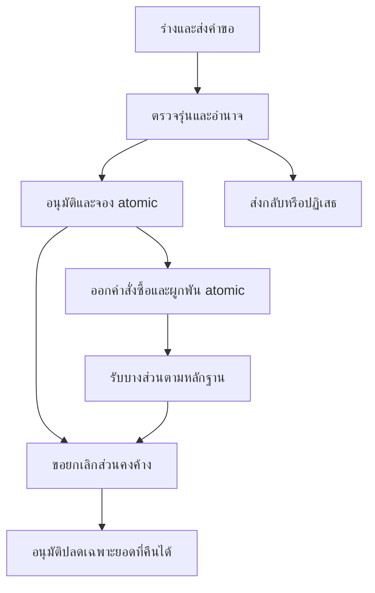

# ขอซื้อขอจ้าง คำสั่งซื้อ และบริการงบประมาณ — บท 48

รุ่น 0.1 | 7 ตุลาคม 2569 (2026-10-07) | source `c6697cb` | **Proposal / BLOCKED — ไม่มี request/order/budget integration ที่รันได้จริง**

บท47และ43ยังไม่ผ่าน core19modelsไม่มีprocurement/order/supplier/ledger/currentAuthDAL/files/workflow/outboxธุรกิจ nativePostgreSQLไม่พร้อมและdb:testรอบ48exit1 เอกสารนี้กับ [PROCUREMENT_ORDERS](PROCUREMENT_ORDERS.md) และ [procurement-48-plan](fixtures/procurement-48-plan.json) เป็นcontracts/PLAN ONLY ไม่มีUI/API/Prisma/migration/seedใหม่ ไม่สร้างbudgetengineหรือloginอีกชุด ไม่อ้างworkflowทดลองว่าแทน e-GP หรือระเบียบจัดซื้อได้

## 1 ขั้นตอนและความหมายของยอด

ใช้ Organization/Person/ItemCatalog/UnitOfMeasure/Project/FiscalYear/BudgetLine/Document/Workflowกลาง ร่างและส่งคำขอไม่เป็นเงินจอง เฉพาะการอนุมัติที่จองสำเร็จจึงเป็น APPROVED_RESERVED; ออกคำสั่งซื้อเมื่อได้รับอนุมัติและมี reservation จริงเท่านั้น ย้าย R ไป U ไม่เพิ่มยอดหักอีกหมวดตาม [BUDGET_BALANCE_FORMULA](BUDGET_BALANCE_FORMULA.md)

การรับบางส่วนต้องบริการรับเข้า/รับรองงานที่พร้อมภายหลัง ส่ง accepted/rejected/pending quantities และหลักฐานผ่านcontract ไม่โพสต์stockหรือจ่ายเงินจากการอัปเดตOrder การรับของไม่เป็นการจ่ายเงิน ไม่มี receipt/stock engineในบท48

| จาก                          | Action / ไป                           | เงินและ guard                                                                                                                                 |
| ---------------------------- | ------------------------------------- | --------------------------------------------------------------------------------------------------------------------------------------------- |
| DRAFT / RETURNED             | save/submit → SUBMITTED               | CASrevision/requirements/currentscope/evidence ไม่มี R/U/P                                                                                    |
| SUBMITTED / REVIEWING        | return/reject/cancel                  | เก็บdecision/history/reason; ไม่มีledgerจากคำขอที่ไม่อนุมัติ                                                                                  |
| REVIEWING                    | approveAndReserve → APPROVED_RESERVED | currentauthority/makerchecker/approved-effectiveplan/period/funding/available; request/decision/reservation/event/receipt/audit/outbox atomic |
| APPROVED_RESERVED            | issueOrderAndCommit                   | ยอดorder<=remainingreservationและapprovedquantity/value; Rลด/Uเพิ่ม atomic; ไม่ออกOrderเมื่อจองล้มเหลว                                        |
| ISSUED / PARTIALLY_FULFILLED | บันทึกผลรับที่ตรวจแล้ว                | fulfilment projectionตามหลักฐาน; ไม่เปลี่ยนR/U/Pเพียงเพราะรับของ                                                                              |
| มีจอง/คำสั่งซื้อแล้ว         | ขอamendment/cancellation              | แยกสถานะกำลังขอจากOrder/เงินที่มีผล ยังไม่คืนยอดจนตัดสินและapplyสำเร็จ                                                                        |
| cancellationได้รับอนุมัติ    | applyCancellation                     | ปลด Rเฉพาะunconsumed, ปลด Uเฉพาะcancelable; คงภาระรับของ/claims/C/P/history ไม่inverseทั้งก้อน                                                |

Request, workflow, reservation, order fulfilment, payment และ cancellation เป็นคนละสถานะ ไม่ใช้ enumเดียวบอกทุกเรื่อง requestถูกปิดส่วนที่เหลือได้แต่orderยังมีหนี้/งานรับรองค้าง ต้องแสดงส่วนค้างแยกไม่ป้ายว่าจบทั้งหมด

## 2 Transaction และ service boundary ที่เสนอ

เว็บไซต์นี้ใช้ PostgreSQLร่วม เลือก synchronous transactionเดียวเป็นข้อเสนอหลัก: procurement serviceรับ trustedactor/expectedrevision/idempotencykeyแล้วใช้transactionกลางส่งtxเดียวให้ budget service43 ไม่เรียกHTTPต่างบริการหรือ nested transactionที่commitแยก ไม่เขียนbudget tablesตรงจากUI/โมดูล7

| Operation เสนอ           | resolve/checkฝั่งserver                                                                                                                                       | ผลในtransactionเดียว                                                                                                                      |
| ------------------------ | ------------------------------------------------------------------------------------------------------------------------------------------------------------- | ----------------------------------------------------------------------------------------------------------------------------------------- |
| approveAndReserveRequest | reloadsealedrequesthash/version/items/units/total/project/line/org/FY/currency/policy/evidence; currentprocurementapproveและbudgetreserveauthorityตามdecision | workflowdecision+requestapproval+reserveBudget43+stableBudgetLink+receipt+audit+outbox; งบไม่พอ rollbackทั้งหมด                           |
| issueOrderAndCommit      | approvedrequest/reservationconfirmed/remaining/source restrictions/currentgrants/period/supplier/evidence/orderqty-pricing/rules; CASapprovedversion          | Order/lines/version+commitReservation43+obligation+receipt+audit+outbox; ไม่มีOrderissuedที่ยังไม่ผูกพัน                                  |
| applyCancellation        | approvedsealedamendment/hash/reason/evidence/currentgrant; impactacceptedgoods/claims/C/P/period/dependencies                                                 | cancellationversion+releaseReservation/cancelUnpaidObligation43ตามpolicy+line remaining+receipt/audit/outbox; ไม่ล้างpaid/acceptedhistory |

ใช้ global lock orderเดียวกับ43/45: period gateก่อน balancesและtypedsource/receiptsตามลำดับที่ทุกwriterกำหนด; ต้องalignprocurement/request/order lockกับfinance/revokeด้วยADR ห้ามอีกwriterล็อกOrderแล้วค่อยperiodหากเกิดกลับลำดับ isolation/rowlocksหรือSERIALIZABLEต้องnativeproof/full boundedretry ไม่ตรวจavailableจากclient/reportเก่าหรือcountthenwrite

idempotency key+hashผูกactor/action/rootrequest/approvedrevision/context/amount; samekey/hashคืนผลเดิมเมื่อcurrentreadยังอนุญาต differenthashconflict และnewkeyไม่สร้างreservation/orderซ้ำผ่านunique business refs BudgetLinkตรึงrootrequestกับreservationเดิม; approvedrevisionใหม่เป็นamendment/delta ไม่เปิดreservationเต็มก้อนใหม่หลบunique approvedrevision43 ตรวจactive rootrequest/context bindingและยอดทุกrevisionร่วมกัน

Order slot/number namespaceต้องserverกำหนดตามpolicy keystableต่อapprovedamendment ไม่ให้clientสร้างslotสุ่มเพื่อconsumeซ้ำ Partial/multipleordersต้องconfigurationยืนยันและตรวจremainingquantity/remainingamountรวมทุกorder ห้ามsplitเพื่อหลบวงเงิน ถ้าpriceรวมสูงกว่าจองให้approvedamendmentเพิ่มจองผ่าน43ก่อนออกorder ไม่topupเงียบ ๆ

หากเปลี่ยนเป็นevent-drivenภายหลัง ต้องADRใหม่ มีRESERVATION_PENDING/FAILED, ledgerreceiptยืนยันก่อนAPPROVED_RESERVED/ออกOrder และcompensationที่รับรอง ไม่markapproved/issuedก่อนเงินสำเร็จ outboxปัจจุบันเสนอสำหรับแจ้งผลหลังcommit ไม่เป็นช่องเลี่ยงinvariant

## 3 Quantity, price และ supplier

จำนวนpin item/service specification/unit/version/conversionตาม47 ราคา/ยอด/currencyใช้exact decimal41–43 คูณquantity×unitpriceแบบexact; precisionเกินmoney scaleต้องroundingpolicyมีรุ่นที่ยืนยันก่อนใช้ ไม่ให้NUMERICcastปัดเงียบ ๆ Estimatedยอดคำขอแยกorder contractยอดจริง

ภาษี ส่วนลด ค่าขนส่ง รวม/ไม่รวมภาษี withholding และวิธีจัดซื้อ/วงเงินยังTO VERIFY ไม่สมมติอัตราหรือใช้0แทนunknown Gross commitment basisต้องpolicy+หลักฐานครบ DEMOชุดนี้กำหนดtotalไม่มีchargesเพื่อทดสอบเลขเท่านั้น ไม่ใช่นโยบายภาษี/เอกสารทางการ หรือสิทธิ์จ่ายเงินจริง

ขอจ้างใช้SERVICEline/specification/unitและmilestone acceptanceตามนโยบาย ไม่ลงitem_kindเป็นasset/materialเพื่อให้ผ่าน FK ไม่สร้างAssetหรือstockจากการจ้าง Supplierเก็บเฉพาะธุรกิจจำเป็นและsnapshotที่ใช้ในOrderตาม [PROCUREMENT_ORDERS](PROCUREMENT_ORDERS.md) ไม่ต้องบัญชีธนาคาร/password/tokenหรือเลขบัตรจริงในtrial

## 4 คืนยอดตามสถานะ

| สถานะเงิน/งาน               | ส่วนที่อาจคืนเมื่ออนุมัติ             | ส่วนที่ต้องคง/เงื่อนไข                                                                       |
| --------------------------- | ------------------------------------- | -------------------------------------------------------------------------------------------- |
| ร่าง/ไม่อนุมัติ             | ไม่มีledgerให้กลับ                    | คงคำขอ/reason/decision ไม่สร้างreleaseeventจาก0                                              |
| จองยังไม่ออกorder           | remaining R                           | releaseอ้างreservationเดิมครั้งเดียวไม่เกินremaining                                         |
| orderใช้จองบางส่วน          | unconsumed Rของrequest                | UของOrderยังคง ไม่คืนทั้งrequestedamount                                                     |
| orderมีภาระยังไม่รับของ/งาน | cancelable Uที่policyและหลักฐานยืนยัน | unpaidไม่ได้แปลว่ายกเลิกได้ทั้งหมด; C/claims/acceptedliability/contractimpactต้องตรวจ        |
| รับบางส่วน/รับรอง/มีinvoice | เฉพาะunfulfilled/cancelableที่อนุมัติ | คงaccepted liability, C/claims/P; หากcertificationขัดต้องapprovedflow44แยก ไม่autocancelC    |
| จ่ายแล้ว/คืนเงินจริง        | ไม่มี automatic releaseP              | correction/refund44มีคำอนุมัติ/หลักฐานใหม่; procurementcancelไม่คืนPหรือเปิดสิทธิ์จ่ายซ้ำเอง |
| งวดปิด/กฎไม่ทราบ            | ไม่applyโดยตรง                        | approvedreopen/adjustment45ตามpolicy ไม่backdateหลบperiodgate                                |

ตัวอย่างสมมติA100000: อนุมัติจอง20000 → R20000/V80000; Order12000 → R8000/U12000/V80000; รับ2จาก6ชิ้นราคา2000/ชิ้น → ยังR8000/U12000/V80000; อนุมัติปลดจองที่เหลือ8000 → R0/U12000/V88000; อนุมัติยกเลิกงานที่ไม่รับ4ชิ้น8000 → U4000/V96000 คงภาระรับแล้ว4000; รับรองและจ่าย4000ภายหลังผ่าน44 → U0/P4000/V96000 **ทั้งหมดreferenceplan ไม่executeหรือpolicyรับรอง**

## 5 เอกสาร สารบรรณ และผลตรวจ

ขอซื้อ/เสนอราคา/ข้อตกลง/คำสั่ง/cancellationเชื่อมDocument/FileVersionกลาง private ต้องCLEAN+currentACL+approvedscopeและตรึงhash/version บริการสารบรรณ8เมื่อพร้อมใช้DocumentLink/Correspondence refเดิม ไม่สร้างเลขหนังสือปลอมหรือเผยเนื้อหาคำสั่งจากtracking URLเพียงรู้ID การเปิดlink/printไม่จอง/ผูกพัน/จ่าย/ส่งหนังสือใหม่

API/ServerActions/DAL/read/export/download/approve/jobตรวจcurrentaccount/action/resource/scope/assignment/delegationทั้งprocurementและfundingboundaries Makercheckerห้ามผู้สร้างหรือผู้แก้สาระสำคัญอนุมัติเรื่องตน techadminไม่businessauthorityไม่ว่าคำขอผ่านUIหรือAPI ไฟล์scanไม่รับรองเงื่อนไขจัดซื้อ/ภาษีเอง

ทุกP48-01–18ในfixture **NOT RUN** เกณฑ์48-01ผูกP48-01–06/12/13/16;48-02ผูกP48-03–11/14/15/18 ทั้งสองBLOCKED ต้อง47/43/ส่วนกลาง/ADR/nativeDB/models/DAL/workerจริงก่อนexecute ไม่ใช้เลขfixtureเป็นผลretry/concurrencyผ่าน ไม่มีe-GP/NBMS/bank API/อำนาจที่ยืนยัน ไม่เริ่ม49
