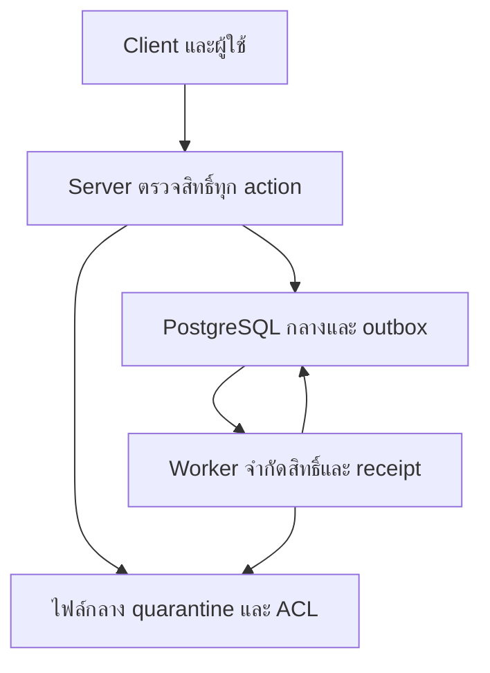

# Threat model — บท 70

รุ่น 0.1 | 9 ตุลาคม 2569 | source `dcf9447` | **REVIEWED_SOURCE / BUSINESS_CONTROLS_NOT_IMPLEMENTED**

โมเดลนี้ใช้เว็บไซต์กลางเก้าระบบ บัญชี Person Organization Application และเอกสารชุดเดียว ไม่มีทะเบียนหรือ login เพิ่ม เจ้าของความเสี่ยงที่ระบุเป็นหน้าที่เสนอจาก Project Charter ไม่ใช่การแต่งตั้งบุคคลจริง ให้ C01 ยืนยันตาม Q005 ก่อนรับความเสี่ยงหรืออนุมัติเปิดใช้งาน

## แนวคิดทีละขั้น

1. ระบุสิ่งที่ต้องคุ้มครอง: ตัวตน สิทธิ์ ข้อมูลผู้เยาว์ คะแนน หลักฐาน เงิน stock และความครบถ้วนของประวัติ
2. แยกผู้ใช้ภายนอก ผู้เรียน เจ้าหน้าที่ ผู้ตรวจ ผู้อนุมัติ ผู้ดูแลเทคนิค และ worker การมีบัญชีหรือเป็น admin ไม่ให้สิทธิ์ธุรกิจทั้งหมด
3. ระบุจุดข้ามขอบเขตความเชื่อถือ เช่น client→server, server→DB, upload→parser, outbox→consumer และ private→public/cache/export
4. วาง abuse case พร้อมผลกระทบ การป้องกัน ผู้รับผิดชอบ และการทดสอบที่หักล้างได้ ไม่ถือว่าแบบออกแบบเป็น implementation
5. แยกข้อพบจริงจากความเสี่ยงหากเปิดฟีเจอร์ และเก็บ residual risk แม้ปิดช่องทางปัจจุบันแล้ว

## ขอบเขตจริงและขอบเขตเสนอ

| ขอบเขต         | สิ่งที่มีจริง                                                                                                 | สิ่งที่ยังไม่มี / ไม่ได้พิสูจน์                                               |
| -------------- | ------------------------------------------------------------------------------------------------------------- | ----------------------------------------------------------------------------- |
| Browser→Next   | starter ข้อความคงที่; `/app/[[...path]]` คืน 403/no-store ทุก method                                          | login/session/account mapping, scope/time/field DAL, business actions         |
| PostgreSQL     | migration 19 ตาราง private, ENABLE/FORCE RLS ครบ, ไม่มี allow policy; PUBLIC schema/table/function ถูก revoke | native DB รอบนี้ไม่พร้อม, runtime limited role/request context, maker-checker |
| Files/import   | Document เป็น metadata; แผนบท 10/60 เท่านั้น                                                                  | FileVersion, quarantine/scan/ACL, parser isolation, staging/commit            |
| Workflow/jobs  | worker ตรวจ SELECT 1/Redis PING และรอ                                                                         | business worker, outbox/consumer receipts/revalidation และ recovery           |
| Public release | หน้า starter ไม่มีข้อมูลทะเบียนหรือคะแนน                                                                      | approved public DTO/release/search/export/CDN invalidation และผู้รับรองนโยบาย |

แผนภาพต่อไปนี้เป็น **สถาปัตยกรรมเสนอ** สำหรับตรวจจุดข้าม trust boundary ไม่ใช่สถานะที่ deploy แล้ว:

Auth/scope ต้องอยู่ก่อนอ่าน count/snippet/ไฟล์หรือ mutate การให้ URL, target_id, tracking number, FileVersion reference หรือ event id ไม่ใช่การอนุญาต Worker ต้องตรวจ assignment ปัจจุบันก่อนทำผลข้างเคียง เหตุการณ์เก่าไม่ต่ออายุสิทธิ์ผู้ที่พ้นหน้าที่

## Risk register

ระดับในตารางเป็น **Proposal ประเมินผลกระทบเมื่อเปิดฟีเจอร์จริง** ไม่ใช่ CVSS หรือหลักฐาน exploit ที่สำเร็จ ระดับ release ต้องให้ C01/C02/C03 และเจ้าของงานรับรอง

| รหัส   | ความเสี่ยง / abuse case                                                                          | ขอบเขตและผลกระทบ                                                                | ระดับเสนอ / owner           | การควบคุมและ oracle ที่ต้องพิสูจน์                                                                                                                          | สถานะ / residual                                                             |
| ------ | ------------------------------------------------------------------------------------------------ | ------------------------------------------------------------------------------- | --------------------------- | ----------------------------------------------------------------------------------------------------------------------------------------------------------- | ---------------------------------------------------------------------------- |
| T70-01 | ขโมย session, account linking ผิดคน, revoke แล้วใช้งานต่อ                                        | authentication ทุกระบบ; impersonation                                           | High; C02                   | central verified account, expiry/revoke/MFA ตาม policy, logoutทุกsessionที่เกี่ยวข้อง; stolen/revoked tokenอ่าน/แก้ไม่ได้                                   | ไม่มีAuth runtime; workspaceปิด แต่sessioncontrolsยังไม่พิสูจน์              |
| T70-02 | แก้ target_id/พื้นที่/บทบาท หรือใช้หน้าที่หมดอายุ                                                | บุคคล01 สถานที่02 คำขอ04 stock/custody07 และทุก read/mutate/export/file/approve | High; C02 + O01/O02/O04/O07 | server DAL + native RLS current scope/time; A/B positive/negative; ไม่join/count/snippetนอกscope; adminไม่wildcard                                          | ไม่มีDAL/grants;403ทุกคนไม่scopeproof                                        |
| T70-03 | อ่าน draft/withdrawn result, scrape/cache exportเก่า หรือเปลี่ยนชื่อปีใหม่ทับปีเก่า              | ผลสอบ05/รายงานกลาง; เปิดเผยหรือบิดเบือนผล                                       | High; O05 + C03             | approved field policy/release snapshot, bounded search/rate, invalidateทุกช่องทางเมื่อถอน; practice03ไม่official05                                          | ไม่มีrelease endpoint;publicมีแต่starter                                     |
| T70-04 | รวมกลุ่มเล็ก/ชื่อ/อายุ/สถานศึกษาจนระบุตัวเด็กได้                                                 | ผู้เยาว์ใน03/05/09 และการเผยแพร่                                                | High; C03 + O03/O05/O09     | minimization, age-aware field policy, aggregate suppression thresholdที่ยืนยัน, purpose/basis/noticeโดยC03                                                  | นโยบายNeeds Legal Review;ไม่เลือกconsentเป็นdefault                          |
| T70-05 | ปลอมชนิดไฟล์, ZIP bomb/XML/formula/macro/external-link หรือไฟล์active content; signed URLข้ามACL | upload/file preview/download/export/import                                      | High; C02 + C03 + O09/O08   | quarantine→magic/MIME→bounded isolatedscan/parser→versionACL; ปิดไฟล์ที่ยังไม่ผ่านscan; SSRF deny metadata/loopback/redirect/DNS tricksสำหรับfetchที่อนุญาต | ไม่มีFileVersion/parser;metadataไม่scanproof;ไม่มีuploadจริง                 |
| T70-06 | makerอนุมัติเอง, ปลอมdelegation/วงเงิน, double spend/reversalผิดต้นทาง                           | budget06/procurement07; เงิน/หลักฐานเสียหาย                                     | High; O06/O07 + C02         | authorityversion+effectiveassignment, maker/checker/approverแยก, exactdecimal/lock/idempotency/uniqueและevidence; ledgeroracle                              | ไม่มีfinancialservices;ไม่ธนาคาร/NBMS/e-GP                                   |
| T70-07 | ส่งหรืออ่านเรื่องลับหลังหมดหน้าที่, เปลี่ยนไฟล์หลังอนุมัติ, destroyขณะhold                       | records08/เอกสารร่วมทุกระบบ                                                     | High; O08 + C03             | record/file/recipient/classACLทุกช่องทาง, approvedhash+version, recipientsnapshot, explicitack, holdก่อนdestroy, auditคงอยู่                                | ไม่มีrecords/hold/services; approval evidenceไม่digital signature            |
| T70-08 | importปลอมปี/ตัวตน/scope, fileเปลี่ยนหลังdryrun, raceเว็บกับbatch, retryสร้างคน/ใบสมัครซ้ำ       | Excel09→Application05กลาง                                                       | High; O09/O05 + C02         | server revalidate checksum/rules/rights/deadline/center, same Applicationservice, atomic boundedbatch, businessunique/outboxในtx                            | ไม่มีstaging/commit;ไม่mergeชื่อคล้ายหรือบังคับThaiIDทุกคน                   |
| T70-09 | event replay/out-of-order, workerใช้credentialเกินหน้าที่ หรือ notificationล้มแล้วsourceซ้ำ      | integration/activation/records/budget/stock                                     | High; C02 + owners          | eventversion/correlation, currentworkerACL, boundedretry/deadletter, receipt atomicกับeffect; sourceไม่สูญ/ซ้ำ                                              | readinessworkerไม่jobprivilegeproof                                          |
| T70-10 | secret/PIIหลุดlog/trace/backup, auditแก้ได้โดยDDL หรือใช้provenanceเป็นauth                      | ทุกระบบ/ops/data rights                                                         | High; C02 + C03             | fieldallowlist/canaryredaction, privateevidence, separationofDDL/runtime, retention/hold/versionedcorrection; serviceactor settingไม่authorization          | sourceมีgenericerrorsและauditfieldnames แต่externallogs/backup/opsยังไม่ตรวจ |

## Recovery และ release gate

เมื่อพบการเปิดเผยให้ปิดเฉพาะช่องทาง/ฟีเจอร์ที่เกี่ยวข้อง ถอน release หรือสิทธิ์และ invalidate cache ตาม policy รักษาหลักฐานแบบ private ไม่ลบ status event/ledger/score/receipt ที่ต้องตรวจย้อนหลัง ถ้า secret ถูกยืนยันให้ revoke/rotate และตรวจประวัติ/ช่องทางเผยแพร่ ไม่ถือว่าลบไฟล์จาก HEAD แล้วแก้เหตุการณ์เสร็จ

Current containment เป็น starter และ workspace denial ไม่ใช่การแก้ช่องว่างทั้งหมด Native RLS เป็น source migration ยังไม่เป็นผลตรวจสิทธิ์ของฐานจริง การเปิดข้อมูลจริงต้องผ่าน security cases และ [DATA_GOVERNANCE_SIGNOFF](DATA_GOVERNANCE_SIGNOFF.md) ของฟีเจอร์นั้น ข้อมูลสมมติยังตรวจ unit/source/HTTP และแผนได้ ไม่ใช้ข้อค้างทางกฎหมายหยุดงานทดลองทั้งหมด

ใช้ [OWASP ASVS](https://owasp.org/projects/asvs) เป็นกรอบคำถามทางเทคนิค ไม่อ้างได้รับ certification ดูหลักฐานและ issue ที่ [SECURITY_REVIEW](SECURITY_REVIEW.md) กับ [review-plan](../tests/fixtures/security/review-plan.json)
